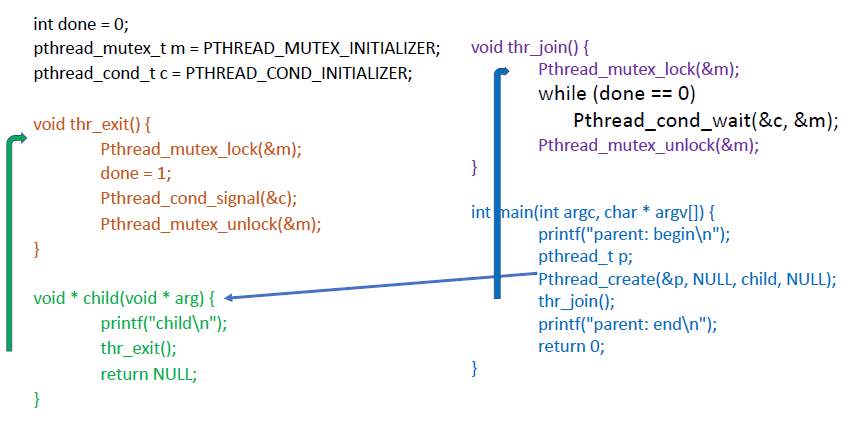
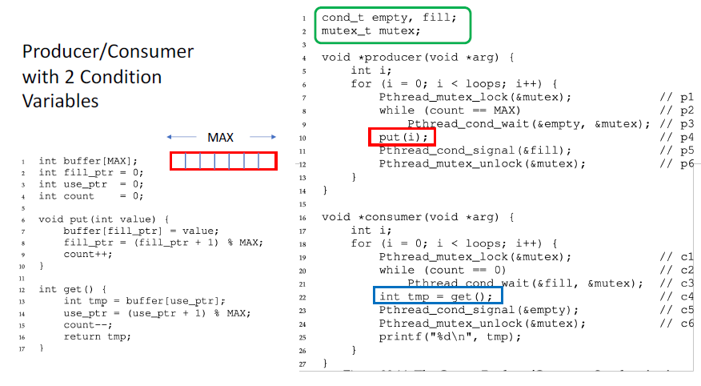
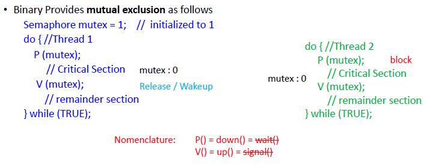

# Lecture 10 13 22 
Topics: 
1. Revisiting the consumer-producer problem
2. Condition variables
3. Semaphores
4. Implementing Monitors
5. Concurrency Applications

## Why Do we need condition variables?
We need a system to safely block a thread in a monitoring function while waiting for the resource to become available. Condition variables solve the issue of busy waiting on a *shared* value. 

A Condition variable (CV) includes a **queue** where a thread can be placed while waiting for some condition or state change. 

> `pthread` does provide CV functionality. 

CV Operations:
1. `wait`
2. `signal` - wake up **single** waiter. 
3. `broadcast` - instead of first in queue everyone in the queue gets a chance to acquire the lock

### `wait()`
The calling process is blocked and placed on a FIFO queue. The ordering of the queue is important as a signal means "if there are waiters release the first one". The `signal(c)` call can wake up blocked waiters by moving waiters from a **blocked** to a **ready** state. 

The wait function finishes returns **only** when we move to a *ready* state. The returning from the `wait()` includes reacquiring the lock. 

In short, condition variables provide mutual exclusion and condition synchronization. 

### Class Example: Intro to Condition Variables



Recall that when we come back from the `Pthread_cond_wait(&c,&m)` the lock **must** be reacquired.

### Class Example: Producer and Consumer



## Semaphore
+ Synchronization primitive like condition variables
+ Semaphore is a variable with an underlying counter (Block/Wakeup & Counting)
+ Two functions on a semaphore variable
	+ up/post increments the counter and releases a waiter
	+ down/wait does the opposite, it blocks the caller

Using Semaphores as locks:

```c
sem_t m;
sem_init(&m, 0, X); //init to X

sem_wait(&m);
//critical section here
sem_post(&m);
```

### Semaphores – a synchronization device
+ Define a semaphore variable: int
+ Define two operations on a Semaphore (down, up) (P , V)
	+ P - **down**
		+ decrement semaphore value
		+ if less than 0, blocks caller
	+	V - **up**
		+	increments the value of the semaphore
		+	if there is a waiter release one of them

A Semaphore is a data structure, it contains:
+ a value
+ a queue of waiters

```c
P(S){
	S--;
	if S < 0 then block(caller);
}

V(S){
	S++;
	if waiting queue not empty
		release ONE waiter
}
```

Notice that a **binary semaphore** is just the mutex lock we have been learning about. This is because if `semaphore=0` (after initial `P()`) the next caller to down shift will block themselves. 

A non-binary semaphore can be a resource counter: we can allow up to $N$ threads access to some data. 

### Binary Semaphore Example


