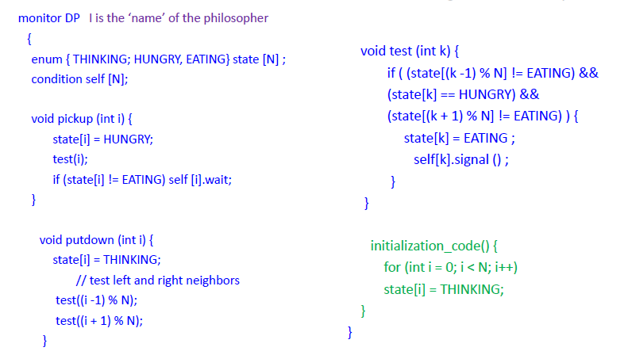

# Lecture 10 18 22
## Semaphores
Two operations:
1. P(s) (down)
	+ **Atomically** decrement the value of semaphore[^1]	
2. V(s) (up) 
	+ **Atomically** increment the value of semaphore[^2] and release a waiter if queue is non-empty

## Monitors (Synchronization)

>  a monitor is a synchronization construct that allows threads to have both mutual exclusion and the ability to wait (block) for a certain condition to become false. Monitors also have a mechanism for signaling other threads that their condition has been met. A monitor consists of a mutex (lock) object and condition variables. -[Wikipedia](https://en.wikipedia.org/wiki/Monitor_(synchronization))

Rules for a Monitor/Synchronization Object:
1. New Calls will enter via an Entry Queue, these calls are blocked outside the monitor until there is no activity in **any** guard procedures. 
2. In the image below Door 1 is *always unlocked*
3. However, door 2 is *unlocked* only if there is no activity in the main room (any guard procedure)


Notice that this type of monitor can be implemented via a semaphore.

```c
p(b_semaphore)
	//body of guard procedure
v(b_semaphore)
```

> `b_semaphore` is a **binary** semaphore. 

## Synchronization in a Monitor - Condition Variable
> How can semaphores provide the functionality of condition variables?

### Semantics
1. Mesa
	+ `wait()` - unlocks lock and block thread (places thread on blocked queue)
	+ `signal()` - puts waiter on ready list from non-empty queue
		+ Signaler keeps lock and processor
		+ before waiter return from the wait function it must reacquire the lock
2. Hoare
	+ `wait()` same as above
	+ `signal()` gives processor and lock to the waiter (signaler is blocked)
	+ When released waiter finished monitor procedure; processor/lock is given back to signaler
	+ nested signals possible	

From OSTEP, we know that the Hoare Implementation says that threads should only be woken up if they are ready to run. This is why on a signal, a waiter runs **immediately**. 

### Hoare Implementation
We have been talking about the Mesa implementation for the past few weeks. 


A thread will leave the *urgent queue* when the waiter gives up the processor. It is called an **urgent queue** because threads from that queue are switched on **first** since they were **already** in the critical section. They are already in the CS they are the ones that gave up the CPU in the first place under the Hoare Implementation.

Implementing Condition Queues
```c
//these two below encompass a condition variable x
semaphore x_sem = 0;
int x_count = 0;

function wait(x){
	x_count++;
	if(next_count > 0){
		V(next); next_count--;
	}
	else{
		V(mutex);
	}
	
	P(x_sem);
	//this will trigger after blocked thread is relased
	x_count--;
}

function signal(x){
	if(x_count > 0){
		next_count++;
		V(x_sem);
		P(next);
		next_count--; //this will trigger after blocked thread is relased
	}
}
```

## Dining-Philosophers Problem


Philosophers think all day, they get hungry and need the rice. The rice is the `dataset` and the chopsticks are a way to access the rice. A chop stick is a semaphore each initialized to 1. 


This is where the semaphore comes in. **ONLY If** two adjacent chopsticks are picked up then they can eat.

### Starvation
Suppose each person picks up their right hand chopstick. Now each is looking for a left chopstick. They will die of *starvation*.

Here is some code that represents this situation
```c
do{

	P(chopstick[i]); //left
	P(chopstick[(i+1) % 5]) //right
		
		//eat
	
	V(chopstick[i]); //drop left
	V(chopstick[(i+1) % 5]) //drop right
	
	
} while(1)

```

### Monitor Solution
Monitor has two functions:
1. `DiningPhilosopher.pickup(i)`
2. `DiningPhilosopher.putdown(i)`

This way we can use:
```java
DiningPhilosopher.pickup(i)
	//eat
DiningPhilosopher.putdown(i)
```

Here is some monitor code for this issue.



## Barriers
Synchronization mechanism where groups of processes work together in phases. Processes go to the next phase only when all are at the end of a particular phase.

Example of this problem:

Image a image processing problem where a thread T gets a group of pixels to smooth over. After they all finish the *new* image gets re-smoothed. Much like the image below, we can only re-smooth **if** the threads are all finished their pixel block of the image. 


### Barrier implementation via Semaphores
```c
n = the number of threads
count = 0
mutex = Semaphore (1)
barrier = Semaphore (0)
// rendezvous (arrive at barrier)
P(mutex)
count = count + 1
V(mutex)
if count == n: 
	//last one triggers a one unblock
	V(barrier) //{like a broadcast()}
else
	//line below blocks all threads that are not the last
	P(barrier)
	//as soon as someone is ublocked they unblock the rest
	V(barrier) 
	//critical point
```	

[^1]:if decremented below zero, thread is put on a queue for waiting 