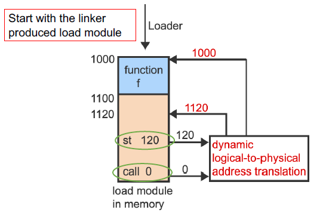

# Lecture 10 20 22 - Intro to Memory Address Translation

In these notes the term `Logical Memory` means memory in the POV of the process/program. It is not the literal physical memory. 

Register VS Cache
1. Register is cell inside the CPU and are controlled by instructions
2. Cache is a cell usually outside the CPU. 

The data that the computer’s CPU that is currently being processing gets stored in the registers. The recently used info/data of a computer gets stored in the cache. 

## Memory Technology
Today's computer systems have memory technologies that help support:
1. Multi threading and processing
2. Virtual Memory

Access time to DRAM memory has not evolved in the same way as processor speeds and architectures have. Processes have gotten faster at a faster rate than DRAM has. 

Multi-level Cache - access time vs cost
+ access time if element required by CPU is found in cache (cache hit)

The reason why caches are able to load future items is because programs are localized[^1], a program has one memory block it touches on often. 

Since each process has a virtual memory block, a hardware address translation is needed to translate between virtual address and physical addresses. This is done by the MMU (Memory Management Unit).

## Memory Management Static Relocation

Image above *assumes* contiguous storage, **no fragmentation**. 

`st` is a `store` instruction.

Notice all the memory addresses start at 0.

The linker will produce an image but it will have addresses ranging from $0$ to the max size of our program $M$ .

> Under dynamic linking, a module is loaded only when a process actually calls the module.

### Runtime of this Program
Notice the third graphic when loaded into memory will not work. For example, the `st 120` will not work since we can't be sure we own that area in memory. 

For the 4th graphic, the memory loader will need to know what commands accessing memory to change. This is how programs were loaded a while back but **not anymore**.

### Runtime - Relocation at runtime

With the modern implementation we **do not** change memory locations within the program. 

**Relocation Register** (Base Register)

Each time a program references some address $A$ a constant number $C$ is added from the base register to get the virtual to the physical address. With $L$ being the limit (see below), $A + C \lt L$ .

There also exists a limit register, it will check if the memory location we are trying to access is out of the range of accessible memory for the program.

**Relocation Flag**

The graphic on the right shows relocation and fragmentation for the program as it splits up its memory components[^3]:
1. Code
2. Static Data
3. Dynamic Data

### Runtime CPU Address Translation Graphic

**ONLY IF** we are addressing in our range (checked by limit register) we can commit operations on the memory[^2]. 

## Base and Limit Issues
+ Term: **Hole** – a contiguous block of available memory; holes of various size are scattered throughout memory (external fragmentation)

When a process arrives it is allocated memory from a *hole* large enough to accommodate it. 

The image does a good service to showing the issue here. We see that $\text{Process}:X$  **can** fit but it is required to be *contiguous*.

The 'solution' here is to **reallocate** the processes to create a hole for $X$ to be in. The 'solution' does not really work since the overhead for relocating entire processes has **high overhead**.

> While the OS moves processes it does no useful *work* in terms of running application code.

**NOTE**: Think about what happens if we need to relocate programs to fill a *hole* while they are completing some IO. 

## Methods of Flexible Address Translation
1. Base and Limit (current)
2. Paging
3. Segmentation
4. Multi-level Translation (Paging or Paging W/ Segmentation)

We will also look at Efficient Address Translation hardware like TLBs (Translation Lookaside Buffers). 

Seeing what we saw in "Base and Limit Issues", we will attempt to make programs **non-contiguous**.

[^1]: In lecture, we are calling this locality.
[^2]: In the image above, the memory is both DRAM and main memory
[^3]: Segmentation