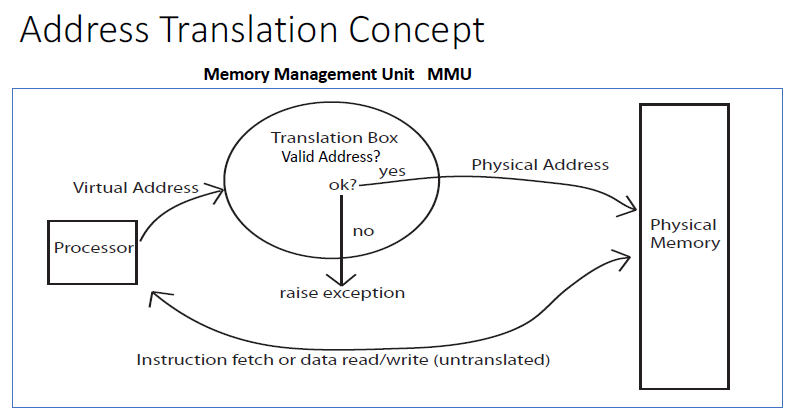
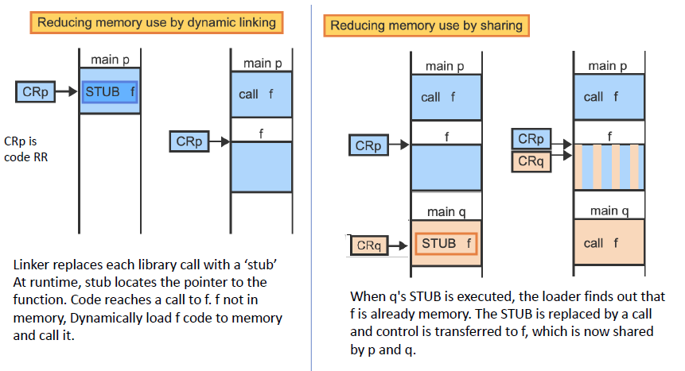
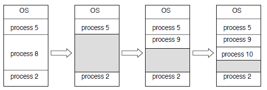
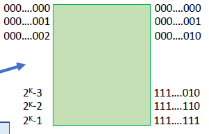
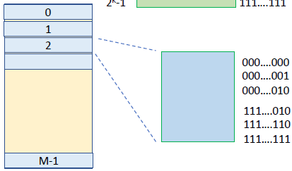
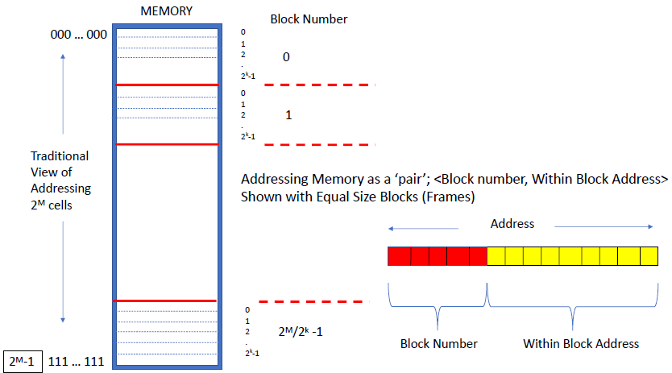
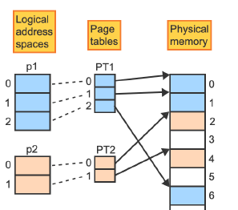
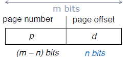
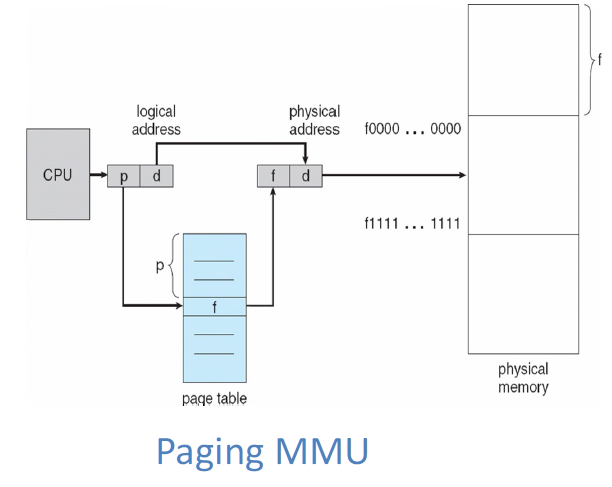
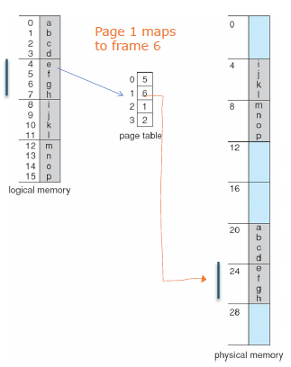

# Lecture 10 27 22
Recall our solution (Base and Limit registers) from last time to form an address space for **contiguous** programs. 



Memory Location: Moving the program around in memory. 

***Dynamic Linking***:
> Linking a code module is postponed until execution time

There is code that runs that locates these libraries and inserts them into code. This is called a *stub*, this stub it will be replaced by the address to the library routines. 



In statement "CRp is code RR", RR stands for replacement register. 

This way memory is saved by not loading **redundant** library routines many times. 

## Memory Fragmentation
Two kinds of Fragmentation
1. External Fragmentation
	+ regions of real memory that are outside of the space occupied/allocated to programs. The space not directly allocated to processes without ‘compaction'
2. Internal Fragmentation
	+ allocated memory may be slightly larger than requested memory; this size difference is memory internal to a partition or allocation, but not being used

When you call `malloc(1)` it is unlikely you will get $1$ byte. You may get $4, 8$ or $16$ .

## External Fragmentation - External to the process
> total memory space exists to satisfy a request for memory, but it is not contiguous.

To reduce fragmentation we need to compact. 



Notice a program **cannot** be moved when it is doing IO. 

## Non-Contiguous Memory Allocation
Two ways to represent a memory cell
1. Direct Integer (left)
2. Binary Integer (right)




We can even partition the memory into blocks. 



The integers on the left are block numbers. 

### Paging
+ Process consists of fixed-size memory blocks called pages
	+ frame size is determined by hardware
	+ In the logical address space blocks are called pages whilst physical blocks are called frames. 
+ Page is a contiguous sequence of bytes
+ Eliminates external fragmentation

### Segmentation
+ Made up of blocks but are not of the same size
	+ Example: A heap, function, array, ... might have a block
+ Programmer identifies logical entities in a program; each is called a segment and is a contiguous set of bytes
+ Facilitates sharing of code, data, and program modules between processes

We can also utilize both at the same time. 

## Paging 
+ divides both the logical address space of a process and the physical memory (RAM) into equal size blocks

A page is a fixed-size contiguous block of a logical address space identified by a single number, the page number. A page-frame is a fixed-size contiguous block of physical memory identified by a single number: the page frame number.

A page frame is the smallest unit of data for memory management and may contain a copy of any page. 

A page table is an array that keeps track of which pages of a given logical address space reside in which page frames.
+ Each page table entry corresponds to one page and contains the starting address of the frame containing the page

We divide real memory into a number of equal-sized contiguous blocks or page **frames**. ( $f_0, f_1, \dotso, f_{n-1}$ ) 

The frames are usually sized in a power of $2.$

The logical space is is divided into equal-sized contiguous **pages** $p_0, p_1, \dotso, p_{n-1}$ ) . 

Recall what a logical address space is from [[Lecture 08-30-22 - Intro to Processes]]:

> Logical Space - The memory space the program is virtualized with. A process will think that this is the space it has



If a program is placed into 5 pages we can place them into any 5 frames. 

### Page table
> Each process has a page-table inside the PCB. 



### Summary
+ Divide physical memory into fixed-sized blocks called frames
	+ OS must keep track of all free frames
+ Divide logical memory into blocks of the same size, called pages
+ To run a program of size n pages, need to find n free frames and load program
+ Internal fragmentation, but minimal

### Address Translation Scheme


Notice the system knows how large a block is. This is how it knows how to subtract off the $n$ bits.  



### Example


### Page-table Management
We said the OS keeps track of the free frames but it also has a cleaning process as well. 

Page table is kept in main-memory.

Page table base register - points to the top of the page while a page-table length register indicates the size of the page table. 

In this translation scheme each instruction requires **2** memory accesses. One for the page table access and one for the data/instruction read/write. (**PROBLEM**)

This two time look up can be solved with caches. There exists a TCB (Transnational Look Aside buffer). 

The entries are:
```txt
ASID - PID
PAGE  #
FRAME #
```

Only *if* there is a TLB miss, we hit the two-time look up. 