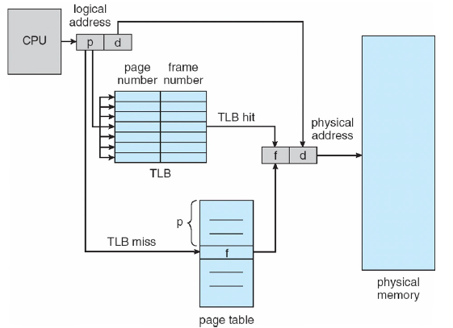
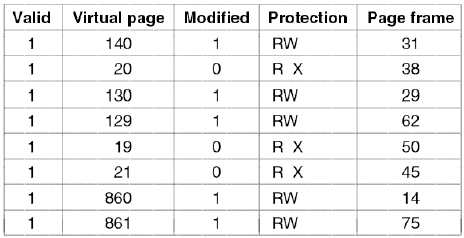
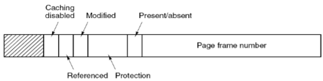

# Lecture 11-1-22

> Spent 1 hour on reviewing midterm (`10-27-22`)

## Page Table
The PT is kept in **main memory** contiguously. 

In the PCB there are:
1. Page-table base register (PTBR) points to the page table
2. Page-table length register (PRLR) indicates size of the page

In this method we need two memory access:
1. Page table access
2. data/instruction read/write

### TLB

To solve the above issue[^1] this we made a hardware cache that holds blocks. We do not need the page table every time. 

This cache is called the translation look-aside buffers (TLBs). 

The TLB stores the following per entry:
1. PID
2. Page \#
3. Frame \#

If a page is not present in the TLB, we need to copy a block into it. This is changing elements of the finite TLB. 

New model:

> p - page, f - frame. The page is from the program while the frame is real memory. 

**Example TLB**

## EAT - Effective Access Time
Assume cycle time is $1$ microsecond

TLB Lookup time: $\alpha$ time units
TLB Hit ratio: $\beta$

The EAT is:

$$
\begin{align}
	\text{EAT} &= (1^a + \alpha)\beta + (2^a +\alpha)(1-\beta)\\ 
	&=2^a + \alpha - 1^a\beta
\end{align}
$$

> $x^a$ time of $x$ memory access (not exponents)

See that $1^a$ references the access time for the TLB as it will take only one cycle to access the TLB entry and use it. By use it I mean convert it to a usable address and fetch.

The $2^a$ represents the page table because We have to (1) convert to frame number and then update the TLB.

To see why we update the TLB before using the address is in this OSTEP Note: [[OSTEP 19 - TLB]].

## Memory Protection
We shall add an Valid-invalid bit in the page table. 

The value “valid” indicates that the associated page is in the process's logical address space, and is thus a legal page for reference.

If the bit is set to "invalid" the frame for the page we want to access is not (yet)[^2] present. 

These are also known as the `present/absent` bits. 

## Structure of the Page Table

The PTE as more entries than just the frame number. 

[^1]:Two memory access per CPU address
[^2]: inb4 Demand Paging