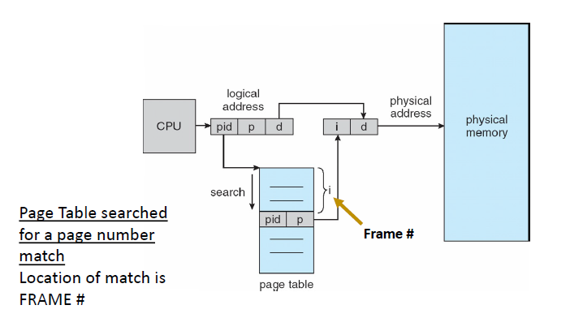
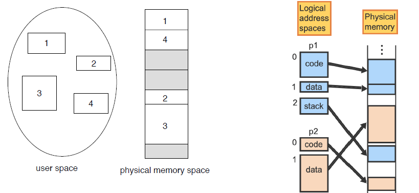

# Lab Design Model


# Lecture 11-3-22

> Reading: Memory Management 12-16, 18-22 OS/3 easy pieces

## Hierarchical Page Tables
Break up the logical address space into multiple components (‘block’ organizations) resulting in the use of multiple page tables:

Address will be in the form
```txt
CompA, CompB, byte_i
```

A Simple Technique us to use a two-level page table. 

### Example


Consider a logical address on a 32-bit machine with 1K page size.
- Page number bits: 22
- Byte offset: 10 

We can think of the old page table as a contiguous data structure but then page the page table. 

Since the page table is paged the 22 bit page bits are separated into
+ 12 bit page number
+ 10 bit *page* offset (same size as a single page)
	+ Has to be the same size as a page since we are trying to page the page table!

$p_1$ is an index to the other page where as $p_2$ is the displacement within the page of the outer page table. 

Before we took page numbers $\to$ frame numbers. 

With this, we break up the page table into blocks. 


**Issue**: 3 memory access to get to a cell. 

## Inverted Page Table
One entry per frame: An entry consists of the virtual address of the page (page number) stored in that real memory location, with information about the process that owns that page. 



> There can only be a one page inside a frame

Notice we have to search this table (sadly). We can make this faster with a hash function. **But**, it does decrease the amount of space used by the page table. 

### Segmentation
> Memory-management scheme that supports a user view of memory

A program is a collection of segments and this is what is stored in blocks in memory. 

Examples of logical Segments:
1. Main Routine
2. Some function
3. Some Object
4. Stack
5. Arrays
6. ...


Example Of Segmentation:



See that with the help of protection bits segmentation allows the sharing of segments such as a code segment. 

**How can we create an address translation scheme if we have no idea how many segments a program will have**?!

See [[Lecture 11-08-22 - Mem_Management Review]]