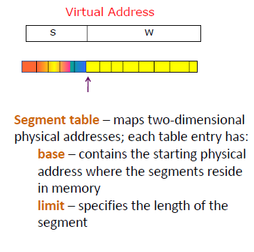
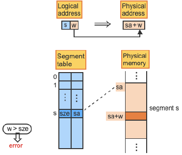
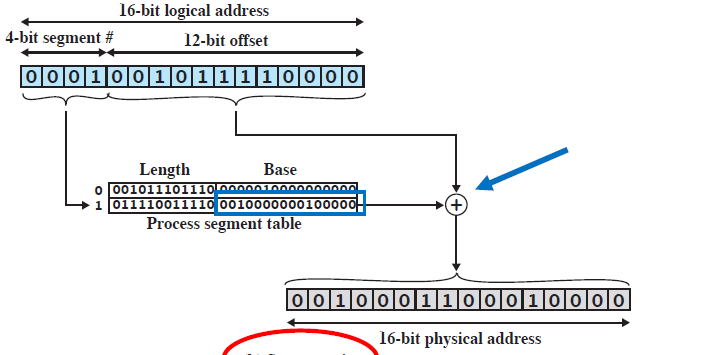
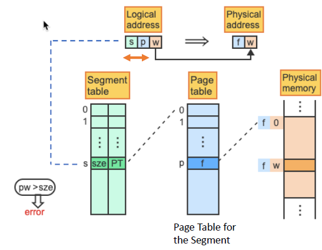
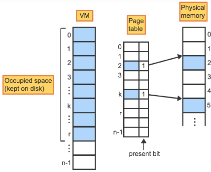

# Lecture 11-08-22

## Big Picture
> Want an OS that can support many programs of **various sizes** to run concurrently

Dynamic Relocation was that idea that the address in a program get translated at runtime. 

This translation was the main source of issues. 

### Contiguous Programs
+ Base / Limit Registers
	+ Overhead for management of space allocation
		+ "holes created by process exiting and new programs"
		+ Holes are removed with OS moving programs
	+ program size limited by physical memory size

### Non-Contiguous Programs

> Break a program into blocks of code/data and store these blocks in non-adjacent blocks in physical memory

#### Paging
##### Overview
- Create a block size of power 2
- split up program into pages (size equal to a block) and put them into any frames (size equal to a block) in physical memory
- $M$ pages can placed (mapped) to any $M$ frames

##### Translation
Location relative to a page is the same as the frame[^1]. Then a table will map pages to frames

CPU provides an address $(\text{Page }\#, \text{OFFSET})$ where the `Page #` is used is as the index to query the table that maps $\text{(Page \#)} \to\text{(Frame\#)}$ .

***Translation Costs***

The table takes space in memory as **each process needs a table**. Moreover this scheme requires us 2 memory access to get 1 location

$$
\begin{align}
&\text{CPU ADDRESS} \to \\
&\text{LOOK UP PAGE TABLE} \to \\
&\boxed{\text{LOOK UP TRANSLATED ADDRESS}}
\end{align}
$$

***Translational Lookaside Buffers - Solution to Translation Costs***

TLBs will cache and can improve with spatial locality and temporal locality. They will cache page and frame mappings so we do not need to perform lookups in the primary page table in main memory[^2]. 

##### Hierarchical Paging

> Paging the page table

This results in 3 memory access per CPU address. 
1. First access: Get to the page of the page table you need
2. Use the page to translate to frame
3. Fetch

> Technically, the initial access to the Page Table Base Register for the Hierarchical page table counts too. 

#### Method 2 - Segmentation

> Blocks are now unequal functional code components (function, main, stack, heap, ...)

Segments however are individually contiguous unlike the virtual address space across segments.

##### Translation
Location will be the same within the segment and the frame[^1]. Table maps program segments to contiguous blocks in physical memory.

**The Process**

1. CPU Provides Segment Number and OFFSET
2. Segment Number is used to index the segment table 
3. Table will contain the *starting* address and the size of the physical block. 

## Segmentation Lecture
Epic Segmentation Graphic:

The logical address are in the form: `<segment-number, offset>`. 

Since we do not know the number of segments. The address segment portion of the address $S$ is based on a max-segment number defined by the OS or hardware. 

> The max-segment number is the maximum of segments allowed per process.

**Segment Table**

The `segment_number` is used to index the table to fetch the segment address **and** size of said segment. 

**Concrete Example Of a Segment Translation**

The issue with segmentation is that we cannot say that for any $K$ segments we can find any $K$ frames in memory to place segments into **without moving processes**.

The solution is below. 

### Segmentation WITH Paging
Segmentation with Paging Graphic:

> Since segments are contiguous we can **page** them!

We will split up segments into pages which can be mapped to any unused frames.

In this scheme, the segment table will map to the page table for that segment. There is a page table per segment type. 

$$
\text{Segment \#} \to \text{Segment X Page Table Address} \to \text{Frame \#}
$$

Another way to think about this is that without the page initially. We start with `<seg#, OFFSET>` but we can page the `OFFSET` bits. 

Much like Two-Level Page Tables, this approach takes 3 memory access. 

However we can employ the same TLB we did for regular paging. Given a tuple `<s, p, w>` the TLB can store `<s, p> -> frame #`. `<s, p>` are the upper bits of the address. 

The TLB will remain an LRU cache with respect to replacement. 

## Summary
> Summary: Avoid simple linear Page Table

We can employ a more complex data structure for the space-time tradeoff. 

+ Both Segmentation and Paging allow data sharing with protection bits

### Segmentation Advantages
1. Supports a sparse address space
2. Decrease size of page tables
	+ If a segment isnt used there is no need for a table for it

### Paging Advantages
1. No **external fragmentation**
2. Segments can grow without having to reshuffle memory
3. Can run process when some pages are swapped to disk[^3]

## Demand Paging

> "Don't bring a page into memory until you need it"

Each page in the table contains a present bit to determine if it has been loaded in main memory or not. 

For example in a `c` program we can load the page for the `main` entry routine however not the **entire program**. When `main` calls some function `f()` that is on a different page that the ones loaded, **that is when the page should be loaded**. 

A `page-fault` is a interrupt generated when a program attempts to access a non-resident page. The interrupt routine will get the OS to load the page and re-doing the instruction that triggered the trap after setting the present but to $1$ .

On program load, all the present bits are $0$ to setup **demand paging**. With demand paging we sacrifice time for speed. 

+ **Page Fault**: This is the interrupt generated when a page is not loaded but required by the program. 

Notice that the last instruction needs to be redone as it is the one that caused the interrupt. This `backup/result` instruction needs hardware help since registers have been changes since *that* instruction was changed. 

[^1]: This is the OFFSET
[^2]: TLB Cache is faster to access than main memory
[^3]: TBD