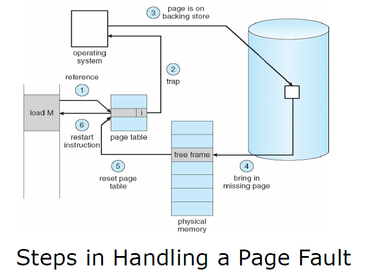
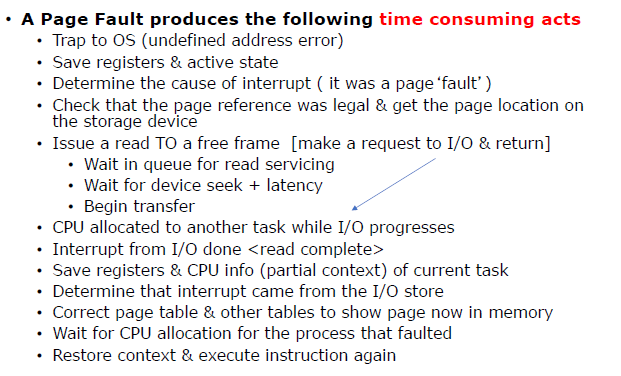

# Lecture 11-10-22 Demand Paging and Swapping

> Read OSTEP 20-22

**Demand Paging**: [[Lecture 11-08-22 - Mem_Management Review]]

In short memory locations we do not call on are not loaded until we do. 

Demand Paging is a another advantage of paging. 

## Page Fault - Instruction Backup / restart

**Learn what a Page Fault is**: [[Lecture 11-08-22 - Mem_Management Review]]

> Following a Page Fault, Restarting an instruction requires hardware support since some memory areas or registers may have been changed prior to the page fault

### Faults

There can be many faults per instruction. When the first *invalid* address is seen a page fault occurs and that page is loaded. This instruction is repeated where another reference will cause a page fault causing its corresponding page to be loaded in.   

### Handling Page Faults

The OS **owns all frames** and it can allocate a frame for a requested page.  

### Choosing a Frames for Pages
If no frame is free there needs to be a page replacement operation. 

Using a page replacement algorithm we need to choose what page to replace. 

**DIRTY BIT** - A `isModified` bit. If you write into a page it becomes modified. Thus if we overwrite a modified page we have no memory of what we changed. 

However if a frame is not dirty it has not been changed since being loaded. Therefore if we replace a unmodified page we can bring it back by going to where we found it. 

## Performance
### Performance of Demand Paging
Memory access time: $.2$ micro-sec ( $m_a$ )
If there are no page faults we need $2x$ the time to get to the page (no TLB)
1. One access to the page table
2. One to find entry

If there is a fault we must bring a page into memory

$p_f$ - Probability of a page fault

EAT for demand paging:

$$
\text{EAT} = (1-p_f)*2*m_a + p_f(p_t + 2 * m_a)
$$

$p_t$ - time to service a page fault (see below)

The process is blocked when a missing page is requested. 

***Summary of Operations***:
1. Service PF interrupt
2. Locate and Swap in the page
3. Restart the process that was blocked (*IO*)

The number of faults more so depends on the locality of the code. 

While (1, 3) are time consuming, it is really (2) that takes up most of the time since it is an IO operation. 