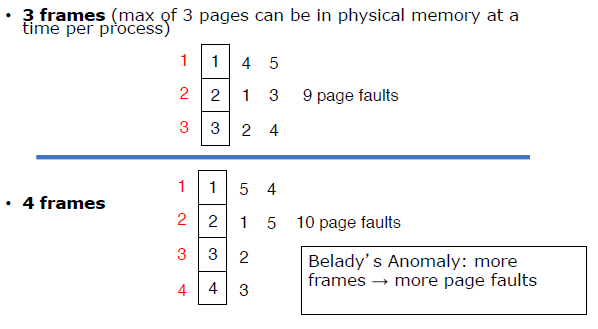
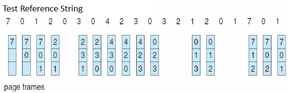
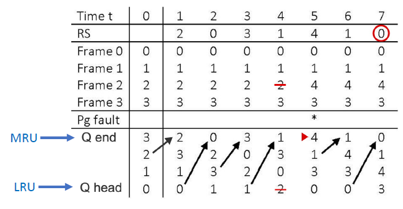
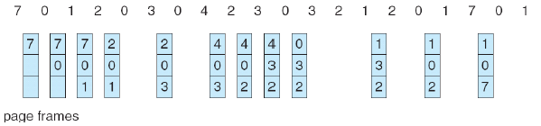

# Lecture 11 15 22 - Page Swapping and Replacement
> Signals are next (accompanied by signals lab)

## Signal Lab Intro
+ Signals
	+ A notification that an EVENT has occurred
	+ Analogous to a software interrupts
		+ In most cases they interrupt the execution of a program
	+ Can be sent by kernel or *another process*
	+ Some signals are synchronous
		+ sent by kernel as a result of a exception in a process
			+ EX: div by 0
	+ Others are async
		+ EX: Signals from other processes

### Signal Delivery
#### Pending
When a signal is generated **it is not** delivered. It is in a pending state until the signaled process is running again. *Or*, the process has blocked that signal using a *signal mask*. 

#### Arrival to Process
There are default actions per signal type. A process can **change this default** behavior by writing a *signal handler*. 

### Signal Mask
Each bit in the mask represents a signal type. We can *mask* a signal to be blocked by setting the bit to one. Otherwise setting the bit to 0 will allow for that signal to pass. 

There are system calls to manipulate masks. 
1. There are signal masks for threads **and** process
2. A thread **inherits** the process's mask while a child process **inherits** the parent's mask

# Lecture - Paging / Replacement

Each page in the main memory has a present bit set to one in the TLB(if the PTE is in the TLB) and the PTE. Accessing a page with an unset present causes a Page Fault. 

Summary of a Page Fault (PF):
1. Service PF interrupt
2. Locate and Swap in request page
3. Restart Process since it was blocked from (2)

Step (2) is very slow due to disk seeks. 

## What Happens in (2) if there exist no free pages ?!
The page replacement abstraction is quite trivial: "find some page in memory and overwrite it or swap it out". 

Designing a performant policy/algorithm for replacement is the complex part. 

Before we look at that, notice that it is harder to replace written to pages than *unmodified* pages. This is because for modified pages we need to save them to disk before swapping in the new page where as for the unmodified page we can just unset the present bit. To retain this information we need a `dirty`-bit. 
+ `dirty=1` - Was modified
+ `dirty=0` - clean **unmodified** page

The dirty bit is not located in the PTE it is in the TLB since we do not want to be constantly writing to the Page Table. On an access the hardware sets the dirty bit in the TLB and if the TLB entry ever gets replaced, **only then** the PTE is updated.  

## Intro to Page Replacement
When all frames are occupied and a page fault occurs, one of the resident pages must be removed from memory to create a free frame. 

Sadly, moving pages between memory and disk is time consuming. *Therefore*, we will use the `modified`-bit to replace unmodified pages to not incur disk write costs.

### Page Replacement Ideals
1. Find the location of requested page
2. Find free frame
	+ If there is a free frame **use it**
	+ If there is no free frame **call page replacement algorithm** to select a *victim frame* to replace. 
3. Update page tables
4. Restart Process and repeat instruction that caused the fault

## Page Replacement Algorithms
Here are two sequence of pages access by a process over time:

$$
\begin{align}
	S_1 &= 1, 2, 3, 4, 1, 2, 5, 1, 2, 3, 4, 5 \\
	S_2 &= 7, 0, 1, 2, 0, 3, 0, 4, 2, 3, 0, 3, 2, 1, 2, 0, 1, 7, 0, 1
\end{align}
$$

In general, the number of page faults decreases with the number of frames. (Expectation)

### FIFO

With $S_1:$

With $S_2$ and 3 frames:

### Optimal Algorithm
Replace page that will not be used for longest period of time. This is not impossible since we are predicting the future. We would need to approximate this behavior by looking at the history of the program. 

### FIFO Cont. 
FIFO takes advantage of locality as the likelihood of referencing a page from the distant past diminishes with time. 

*However*, FIFO fails to recognize that a program frequently returns to pages referenced in the distant past. If the oldest page has just been referenced and a new page comes along the oldest page (which was *just* access) is replaced. 

> In other words it ignores when a page is referenced. FIFO only worries about the first time something is referenced. 

### Using History : LRU
Look for the page that has not been used in the longest time and replace it instead. We can use a queue for this and update it per reference:

This generates a lot of overhead and thus LRU behavior must be *approximated*. 

Here is $S_2$ which causes 12 faults:

Another idea to approximate LRU behavior is to add a time entry to the PTE and update it per reference. When a page needs to be replaced look for the lowest time entry. 

This presents a new slew of problems such as writing to memory each time a page is accessed as well as keeping track of time and searching a page table linearly to find the minimum entry.  