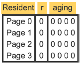
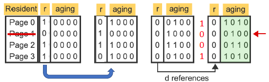
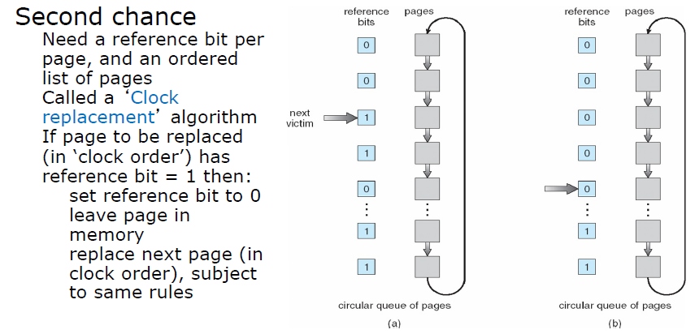
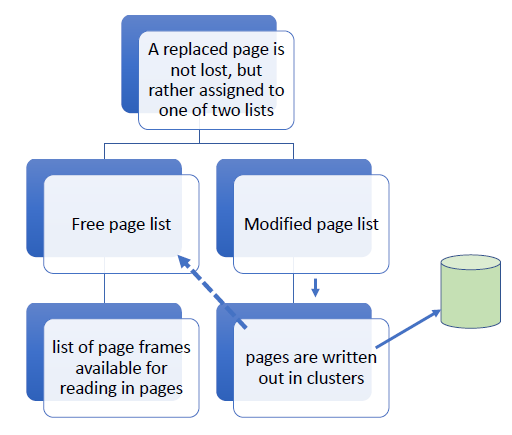

# Lecture 11 17 22
> last lecture before break

**Preface** on page swapping: 

Before we load the pages into memory the page table will contain address into the disk for all the parts of the program. With demand paging, the page will be fetched from the disk. When we replace a page that was was modified, the page table will be updated with the address of the modified page on disk. 

## Page Replacement Algorithms
We need Page Replacement Algorithms to support demand paging when a process *demands* a page yet no frames in physical memory are available. 

The Page Replacement Algorithms we select to serve this purpose must be efficient, this means that it must not replace pages too often nor should it replace the wrong pages too often.

## Page Replacement Algorithm: LRU
See [[Lecture 11-15-22 - Lab 4, Page Swapping, Replacement]] for more details on LRU. 

LRU will select a page that has not been referenced the longest as a replacement candidate. 

This is different from FIFO since FIFO does not change its order if a page already in the queue was reused. However, *LRU* does. The most recently used page is at the end of the queue and when its time for replacement we take off the first page in the queue. 

## Alternative Implementation for LRU (Approximation)

Instead of trying to attain LRU we can try to archive "Not Frequently Used" (NFU) behavior. What you will see below is that we remove pages that are not frequently used rather than really worrying about the literal **least recently used** page. 

> A reference bit is used to reduce the overhead of queues and time stamping. 

1. Start program with all reference bits set to 0
2. Have a clock interrupt
3. When we access a page (read/write) set the reference bit to 1
4. On clock interrupt increase the counter for all pages where `ref_bit = 1`. 
5. Pages with lower counters are not accessed often and thus are removed. 

This may seem like it works but there is no notion of age here. Pages that have higher numbers will tend to keep them. 

### Implementation
Set the reference bit in the TLB via hardware (faster) and when TLB entry is ejected copy to full page table.

An aging register of $n$ bits associated with a page and is shifted periodically to the right by 1 bit.



The aging page replacement algorithm does not maintain pages sorted in the exact LRU order, but groups together pages referenced during a period of d consecutive references. Each period is represented by 1 bit in a periodically shifting aging register.

The $r$ bit is being rotated into the aging bits. In the end we end up with the history of $r$ bit values. 



The lowest aging binary value page will be *selected for replacement* upon a page fault.  

## Page Buffering and Enhanced FIFO
LRU algorithms yield very good performance in minimizing page faults but have a lot of overhead. We would prefer something like FIFO which was easy to implement. 

### Second Chance Policy
Again there is a clock that runs and interrupts. 

OS keeps a circular linked list of pages associated to a process. Each entry has a page and reference bit. When a page is accessed its reference bit is set to 1. 

The OS keeps a pointer to a page in the circular cycle. When a replacement is required first page with a `ref_bit=0` gets replaced. On each clock interrupt all are set back to 0.



Each page is considered for replacement in a round robin manner. If the reference bit is zero then it will be replaced. If the bit is one then it will be set to zero and given a *second chance*. 

If all the bits were ones then one of them will be replaced anyway. 

#### Enhanced 2nd Chance
We can add a modified/dirty bit. 

Here is the replacement priority for this scheme:
```
R M|
0,0: neither used recently nor modified
0,1: not used recently, but modified
1,0: recently used but clean (not modified)
1,1: recently used and modified
```

### Page Buffering 

> The OS reserves a pool of frames to use for Page Buffering

+ Each process is given a maximum number of frames (Resident Set - RS) to use and organized in a FIFO list.
+ When a process exceeds its RS a page is removed from the process and given to the OS to manage. The OS will manage the frame that it just took from the process and gives a free frame from the pool it reserved. 
	+ When this page is given to the OS it is put in one of two pools
		+ Clean List (`modified=0`)
		+ Dirty List (`modified=1`)

Now this is great when a page is requested that was given away earlier the OS can just give back the frame which is already in memory saving IO operations. 

Combining Page Buffering with FIFO gives great performance. Recall the page table contains an `invalid/valid` bit. If a process gives away a page it can keep the same PTE yet set the valid bit to 0. When a process wants this page again a page fault is triggered where the page is put back into the process and a frame is traded with the OS. 

**Note:** This only occurs if the OS kept the page intact. During a page trade or after, the OS *may* choose the recycle the page if the memory pressure is too high. 



## Array Example
Consider an array $128\times128$ where *row* is a page. 

If we iterate column wise:
```c
for i = 0:128
	for j = 0:128
		arr[j][i]
```

That can be $16384$ faults.

If we went row-wise this would have been $128$ faults.

## Fetch Policy
### Prepaging
+ pages other than the one demanded by a page fault are brought in
	+ ineffective if extra pages are not referenced once loaded in memory
+ if pages of a process are stored contiguously in secondary memory it is more efficient to bring in a number of pages at one time
	+ Getting to the place on the disk takes long, thus when we get to a spot read more than just 1 page in a row.  
+ exploits the characteristics of most secondary memory devices where reading is faster than writing on disks 
