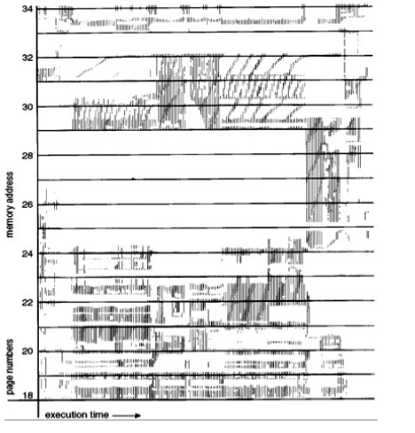
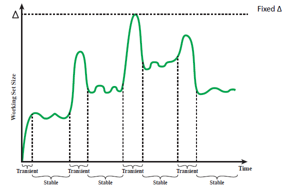
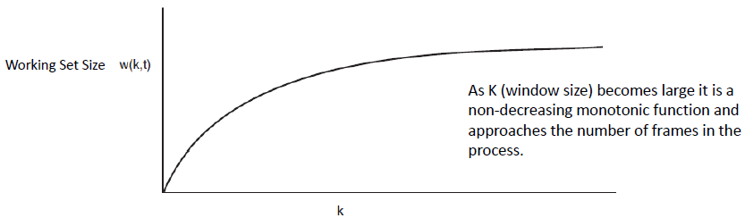
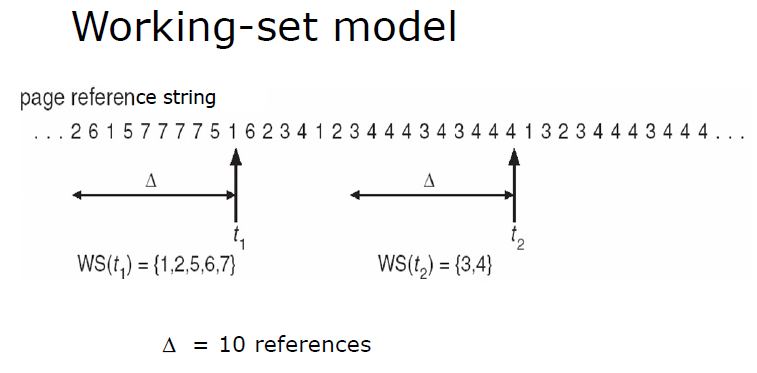
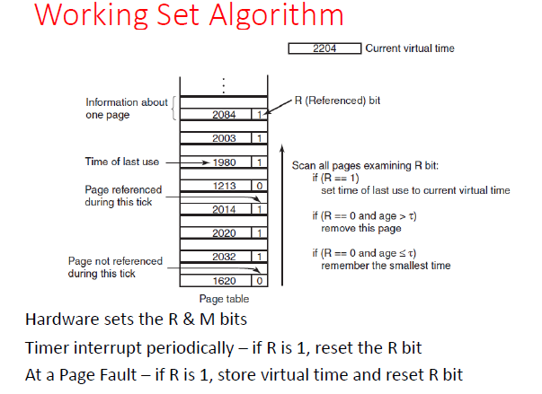

# Lecture 11-29-22 - Page Fetching Cont.
## Fetch Policy
> The Fetch Policy determines when a page should be brought into main memory.

Two common strategies we have learned:
1. Demand Paging - [[Lecture 11-10-22 Demand Paging and Swapping]]
2. Prepaging - [[Lecture 11-17-22 Page Fetching and Replacement]]

### Demand Paging
Brings pages into memory when a reference to *that* page is made. Initially, there are many page faults when the process is started since there are no pages. Subsequently, the next references will likely be to pages that already exist and thus there is a lower chance of page faults. 

### Prepaging
This is when pages other than the one demanded by the page fault are loading in.  

> Prepaging is not to be confused with swapping a process where the entire resident set is moved out the main memory and brought back in when resumed. 

#### Why Prepaging

if pages of a process are stored contiguously in the secondary memory device it is more efficient to bring in a number of pages at once. Notice in a disk the arm has to *move to the location on the disk* and then read. The process of reading in many contiguously pages skips the seek time for the disk and thus is advantageous. 

#### Prepaging Disadvantage

The disadvantage of prepaging is shown when the extra pages are not referenced once loaded into main memory. 

## Resident Set Management
The OS must manage per process how many pages to bring/keep in main memory. 

### Preface
The smaller the amount of memory per process the more process can coexist in main memory. However this will lead to **more page faults**.  

Beyond a certain size the number of page allocation does not matter:
1. Too many frames: unused frames
2. Beyond a certain size the number page faults do not decrease

### Resident Set Size Allocation Polices
#### Fixed Allocation
OS gives a process a **fixed** number of frames in main memory. When a fault occurs of the pages assigned to *that* process is replaced. 

#### Variable Allocation
The frames allocated to a process varies over its runtime. 

#### Replacement Scope
The scope of a **page replacement policy** can be:
1. Local - chooses only among the resident pages of the process that generated the page fault
2. Global - page replacement considers all unlocked pages 

Notice a *global* policy is more prone to page faults. 
+ If the OS gives a page to a process that some other process needs

**Note**: A Fixed Allocation cannot be global while Variable Allocation can be. 

#### Fixed Allocation w/ Local Scope
+ Decide ahead of time how many frames per process

If the allocation here is too small:
1. High Page Fault
2. Due to (1) increased process idle time
3. Due to (1) more time spent in swapping

If the allocation here is too large:
1. Wasted frames

#### Variable Allocation w/ Global Scope
Easy to implement as OS maintains a list of free frames. A free frame (if possible) is added to the resident set when a fault occurs.

If there are no free pages, the OS must choose a page to replace that is *already* in memory.
+ Choosing a global page can have negative effects on victim process. 

> This works really well with Page Buffering (See [[Lecture 11-17-22 Page Fetching and Replacement]])

#### Variable Allocation w/ Local Scope

> Decision to increase or decrease a resident set size is based on the assessment of the likely future demands of active processes

+ When a process is loaded give it a certain number of page frames 
+ When a fault occurs select a page to replace among the resident set of the faulting process
+ Periodically reevaluate the allocation provided to a process to inc/decrement it for memory performance. 

### Working Set 

> Program needs a certain set of pages resident in memory to run efficiently. If this frame criterion is not met, a lot of page faults occur. 

The optimal working set of a process is the set of pages that will be needed in the immediate future and thus should be resident. This cannot be determined and hence it is named "optimal working set".

#### Locality Of Reference Experiment

Given a small time window $\Delta t$ we notice that not a lot of frames are required for that interval of time even though the process access many pages over its run time. 

**Graph of Working Set Size**

The humps are generated from the process moving between working sets. 

**Relation Between Working Set Size and window size**

$$
w(k, t) = \underbrace{(t-k, t)}_{\text{time interval}}
$$

The window size is in virtual time units $(t-k, t)$ . 
+ Virtual time could be instruction cycles with 1 instruction per cycle, or any other consistent unit.
+ Virtual time is time elapsing whilst the process is running on the CPU. 

### Working Set Strategy
> Variable Allocation, Local Scope

1. Monitor Working set size per process
2. Periodically remove from the working set of a process, pages that are no longer in the working set
3. A process may only execute if its working set is in main memory (working set = resident set)

### Working Set Model
+ Working Set Window 
	+ a fixed number of page references (as shown in the last image)
+ $WSS_i$ - working set size of Process $P_i$ = total number of pages references in the most recent interval $\Delta$
	+ if $\Delta$ is too small it will not encompass entire locality
	+ if $\Delta$ is too big it it will encompass several localities

Lets define demand $D$ as 

$$
D = \sum_i \text{WSS}_i
$$

If $D > m$ for $m$ being the total number of free frames in the system, we need to suspend processes. 

$D > m$ causes **thrashing** where little work is being done due to too many IO transfers due to page faults. 

**Definition: Thrashing** - A state in which the system spends most of its time swapping process pieces rather than executing instructions. Thrashing will decrease the degree of Multiprogramming. 

> See that if $D \gt \sum_i \text{WSS}_i$ each time a process is given time on the CPU it will likely need to bring its pages back if $D >> \sum_i \text{WSS}_i$

### Working Set Implementation
However, it is hard to predict working set size before hand. We need to keep track when pages are referenced to ensure when we replace a page it is really the oldest page referenced (LRU). 

### Working Set Algorithm

Assume the $r$ and $m$ bits work as before. Now there is a clock interrupt that runs which will clear each page's $r$ bit back to 0. On a asynchronous page fault a page will be selected to be replaced. 

If $r=1$ , the current time is written to the "last used" field. Since this page is referenced recently[^1] it will not be replaced.  

If $r=0$ , this page is candidate for removal. The difference between its last use and current clock time is compared to $t$ as shown on the image. 

If all pages's age is less than $t$ then the *oldest* page such that $r=0$ is replaced. The WS Algorithm keeps scanning here. One scan can result in many removals. 

If no pages are found with $r=0$ , a clean page with $r=1$ is replaced, if it exists[^2]. 

[^1]: We can assume this page is referenced in the last clock tick. 
[^2]: If nothing exists, evict the LRU page. 