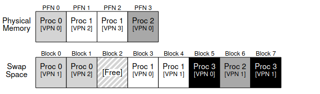

# Swapping Mechanisms
In the previous readings we have assumed that the address space resides in main memory. This is far from the truth in modern operating systems, not all pages of each process reside in main memory. 

To support a larger address space (more processes) the OS needs to stash away unused pages in the lower portion of the memory hierarchy. This is where the hard disk comes in. The question here is that how will using a slower device help us support a larger address space. 

***Why even have a larger address space?***
The answer is simple, it provides a very useful abstraction for developers. They can write programs larger than the amount of RAM a machine has without having to deal with edge cases. Moreover if the OS provides this abstraction developers **do not** have to manually swap out pages to disk or recall them. 

## Swap Space
The first thing we need to ensure is that there exists space on the disk to swap to (**swap space**). The OS will need to remember the disk address of this *"swap space"*. 

4 page physical memory with 4 process. The 4th process is not active (suspended); all its pages are swapped. 

## Table Entry and the TLB
The TLB in this section is "hardware managed". If a page mapping is not located in the TLB the hardware will search for it via the PTBR[^1] and update the TLB. The instruction that caused the *TLB miss* **will be repeated** however this time, the entry will exist in the TLB. 

### The `Present` Bit
We require the present bit in a PTE to tell us if a page is in main memory or not. Accessing a page that is not present results in a page fault which is handled by the page-fault handler.[^2] 

### Page 'Fault'
If the page is swapped to disk it needs to be brought back into main memory. 

**How will the OS even find this page?** Since the PTE has space for an address we can store the disk address. 

After the disk IO[^3] completes, the OS will update the PTE with the new PFN/VPN. Now that the PTE exists a TLB miss can add this page to the TLB. 

## Memory Full
> What if the main memory **is full** and a process requests page from the swap space?!

The solution is to *replace* (page-out) one of the pages in memory for the requested page. Choosing who to "kick-out" is known as the replacement policy (Covered in [[OSTEP 22 - Swapping Policies]]). 

It is **critical** to not remove the wrong page as it could be fatal or cause performance slowdowns[^4].  

### Replacements
Firstly, the OS does not wait till memory is full to start evicting pages.

To keep some memory free most OSs will use a watermark[^5] system to choose who to evict. 

Variables:
+ $HW$ - High Watermark
+ $LW$ - Low Watermark

If the number of pages left in memory are less than $LW$ a swap daemon runs. The daemon swaps pages until there are $HW$ pages left free. 

Here is an alternate interpretation I found:

By grouping a lot of swaps together there are some performance benefits. This is because it reduces seek and rotational overheads of a disk

[^1]: Page Table Base Register
[^2]: When the hardware does not know what to do it will hand control to the OS
[^3]: IO generated from copying disk -> memory. Remember IO calls are blocking which means other process will run while pages are swapped from disk.
[^4]: Imagine swapping out the wrong page and causing a process to run at disk speed compared to memory speed. 
[^5]: Really wondering why did they name it like this. 

