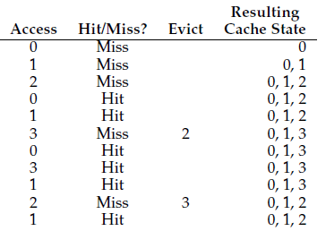
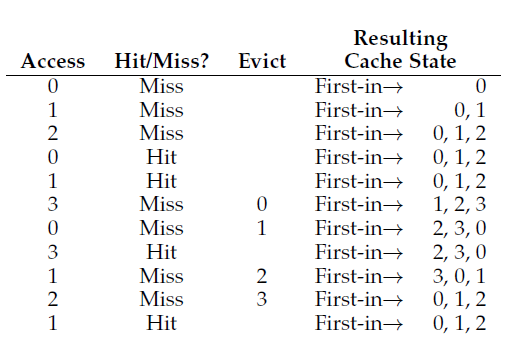
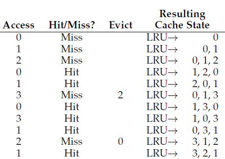

# Swapping Policies
> This note focuses on what occurs when little memory is free and a page needs to be replaced. 

About Page Faults and Intro to Replacement:
1. [[OSTEP 21 - Swapping Mechanisms]]
2. [[Lecture 11-10-22 Demand Paging and Swapping]]

When there is little memory left (high memory pressure), the OS starts **paging out**. The policy for choosing which page to evict is historically important. 

## Preface: Cache Management
Now that we have dropped the "all pages are present in main memory" idea we can say that **some subset** of all virtual pages live on the main memory while the rest live on a slower disk space. Thus, we can view the main memory as a cache for all the virtual pages on the system. 

> Our goal is to reduce the number of **cache misses**, that is we do not want to be replacing a lot of pages. 

### AMAT - Average Memory Access Time

$$
\text{AMAT} = T_M + (P_{\text{Miss}}\times T_D)
$$

- $T_M$ - Time to access Memory
- $T_D$ - Time to access Disk
- $P_{\text{Miss}} \in [0, 1]$
	- $P_{\text{Miss}} + P_{\text{Hit}} = \mathbf{1}$

Given that sometimes accessing disk might be slower than main memory in magnitudes of thousands, a small change in the $P_{\text{Miss}}$ can slow down a machine drastically.

## Optimal Replacement Policy
The Optimal Replacement Policy is to replace the page that will be accessed furthest in the future. 

> It is not possible to write such a policy because it can see into the future. 

### Short Example

Suppose a process calls the following pages: $0, 1, 2, 0, 1, 3, 0, 3, 1, 2, 1$ and the cache can fit at most 3 pages.

Initially, the cache is empty ("**cold start**"), meaning it will miss for each page. See that $2$ is the first to be evicted since it will be the latest to be accessed by the process. 

Types of cache misses:
1. compulsory miss (the cold start misses above)
2. capacity miss - cache full $\implies$ eviction
3. conflict miss - hardware limits where an item can be placed in the cache

In the above example we have $6$ hits and $5$ misses. This is a hit ratio of $.\overline{54}$ , but if we ignore the compulsory misses, the hit ratio is $\frac{6}{6+1}$ .

Sadly there is no way to build a policy that is able to predict the future. 

## Simple Polices
### FIFO
To avoid the complexity of a replacement algorithm many early operating systems employed FIFO replacement. 

FIFO cannot judge the importance or age of pages and thus performs badly. 

### Random
> Eviction at random. 

## Using History: LRU / LFU

### LRU - Least Recently Used

We are counting on the fact that *because* a page was used in the past it will be used again. We use recency of access, a principle of locality to inform future page usage. 

The most recent item is the in the back while the next to be evicted is at the front. 

### LFU - Least Frequently Used

> The Least-Frequently-Used (LFU) policy replaces the least-frequently used page when an eviction must take place.

## Implementing History-based Algorithms for Page Replacement
Unlike FIFO, the LRU algorithm needs *more* accounting work to be done per each memory reference to keep of which page was must recently used and which pages is to be evicted next.

Hardware could come into play here. For example, it can update a time field per memory access. Then when a page needs to be replaced the system can scan the time stamps and remove it. However, scanning each page for a timestamp is not very efficient. 

## Approximating LRU
First we introduce a `use` bit[^1] which is initialized to 0. Whenever a page is referenced (read/written) the use bit is set to 1. 

### Clock Algorithm
Suppose replacement needs to occur and the current page in use is $P$ .

If `P.use == 1` then this implies the page was recently used meaning that it should not be replaced. This page's use but is set back to 0. Then $P$ is incremented to the next page and the same process occurs until a unset use bit is found. *That* page is then replaced. 

There are many variants of the clock algorithm, for example we do not have to increment to the next page, we can always choose a random page to do the same process with.  

### Dirty Pages
+ Dirty/Modified Bit - Has the page been modified?

If a page has been modified[^2], it must be written back to disk before eviction (expensive!). What happens if its not dirty? It can simply be deleted as if its needed it can be recalled from its origin. 

A dirty bit can be added along with the clock algorithm above. A dirty bit is set when a page is written to. The clock algorithm should be modified then to evict clean pages first and then dirty pages. 

## Other Virtual Memory Policies
While we did explore page replacement, there is still the question of what pages to bring into memory initially[^3]? 

We did look at demand paging in [[Lecture 11-10-22 Demand Paging and Swapping]]. The OS could also guess in terms of locality which pages will be accessed next and *prefetch* them, usually if $P$ is accessed the OS may bring into memory $P+1$ . 

There is also the literal swapping policy. How should the OS swap out pages? We could swap pages as they are called or employ grouping[^4]. 
+ Batching page-outs vs singular page-outs

### Thrashing
+ Thrashing: When the memory demands of the processes running exceeds the available physical memory. (see [[Lecture 11-29-22 - Page Fetching Cont.]])

#### Admission Control
> "sometimes better to do less work well than to try to do everything at once poorly"

Given a set of process a system may choose to run a **subset of them** with the hopes that the smaller set of processes will fit in memory[^5]. 

Some systems will **end** a memory intensive process. This is clearly an issue. 

[^1]: AKA reference bit
[^2]: Now its dirty
[^3]: Page Selection Policy
[^4]: AKA clustering
[^5]: The hope here is that the working sets (active used pages) will fit in memory. 

