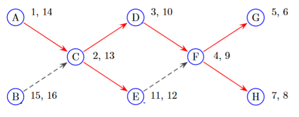
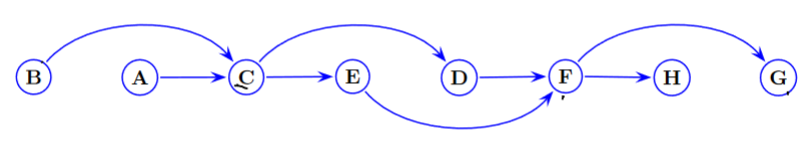

# Topological Sort

> A Topological ordering is **non-unique**

From: [GeeksForGeeks](https://www.geeksforgeeks.org/topological-sorting/)

> Topological sorting for Directed Acyclic Graph (DAG) is a linear ordering of vertices such that for every directed edge $u\to v$, vertex $u$ comes before $v$ in the ordering.

## Algorithm

**Steps**:

1. Complete DFS on the graph with Pre/Post Numbers
2. Order the vertices in decreasing post numbers:

$$
B\ A\ C\ E\ D\ F\ H\ G\ 
$$

3. Draw Graph by drawing edges

## Why Does this work?
Lets ignore $B$ for now. 

For every vertex, we only pop the vertex off the stack **only if** we visit all of its children in DF. 

The vertices to come off the stack first will have lower post numbers but, are also deeper in the graph (more prerequisite nodes). Thus lower post numbers are placed to the right as the leftmost nodes precede them.

Nodes like $B$ (that have no prerequisite nodes) exist because a Topological Sort can start at any point. Since we did not start at $B$ , $B$ will be added to the stack last since it will not be traversed in the initial DFS. 

> **Note**: The stack will be empty when $B$ is added to it. 
