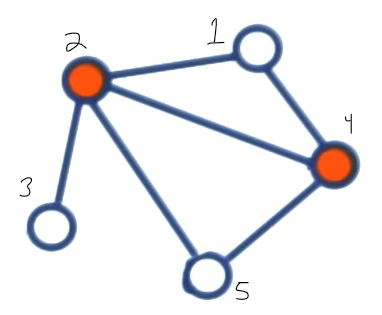
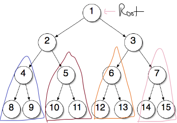
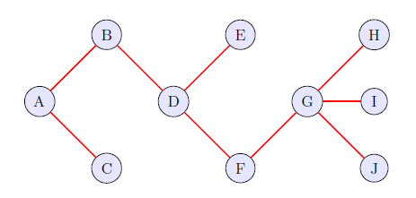
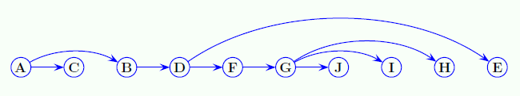

# Independent Sets in Trees
## Definitions
Given a graph $G=(V, E)$, $S\subseteq V$ is an **independent** set if there are no edges between vertices in $S$ .

Vertices $2, 4$ cannot form a Independent Sets  yet vertices $1, 3, 5$ can.

A **maximal independent set** is a subset $S$ such that it is not a proper subset of any other independent sets of $G$ .

> A proper subset of a set A is **a subset of A that is not equal to A**

From Class Notes:

Finding a maximal independent set for a graph  
is an NP-hard problem, but there is a linear time solution if the graph is a tree.

## Linear Time Algorithm 

Unlike a graph a tree has **NO** cycles. Therefore we only have to consider a few cases:
1. Include the root
2. Not Include the root

See that the colored nodes are **already** disjoint. 

## Terminology 
- $T(u)$ - subtree if tree $T$ starting a node $u$
- $L(u)$ - size of maximal Independent Sets contained in $T(u)$
- $S(u)$ - True if $u\in T(u)$

Let $r$ be the root of Tree $T$ , then $L(r)$ is the size of the maximal independent set in $T$

$$
L(u) = 
\max\biggr(
1+\sum_{\text{grandchildren } w \text{ of } u} L(w), 
\sum_{\text{children } w \text{ of } u} L(w)
\biggr)
$$

What this says in English is that the Maximum Independent Set in a tree either includes the root or it does not. 

The two choices in the $\max(\dotso)$ represent choosing between $S(u)=1$ or $S(u)=0$ .

## Algorithm

The second image is a Topological Sort (See ![[../Week 11/01 - Topological Sort]])

> If $u$ is a leaf, $L(u) =1= S(u)$ . This is because leaves do not *go anywhere*. 

We will start by traversing $T$ in reverse order. 

Initially:

| **L** |     |     |     |     | 1   |     |     | 1   | 1   | 1   |
| ----- | --- | --- | --- | --- | --- | --- | --- | --- | --- | --- |
| **S** |     |     |     |     | 1   |     |     | 1   | 1   | 1   |
| **V** | A   | B   | C   | D   | E   | F   | G   | H   | I   | J   |

Next We consider $L(G)$ : (see formula for $L(u)$ above)

$$
L(G) = \max\biggr({1 + \mathbf{0}, L(H) + L(I) + L(J)}\biggr) = 3
$$

Notice that $3$ only occurs when $S(G) = \text{false}$ . That is only if we do not include $G$ its children can be counted since it has 0 grandchildren.

| **L** |     |     |     |     | 1   |     | 3   | 1   | 1   | 1   |
| ----- | --- | --- | --- | --- | --- | --- | --- | --- | --- | --- |
| **S** |     |     |     |     | 1   |     | 0   | 1   | 1   | 1   |
| **V** | A   | B   | C   | D   | E   | F   | G   | H   | I   | J   |

Next We consider $F:$

$$
L(F) = \max\biggr({1 + L(H) + L(I) + L(J), L(G)}\biggr) = 4
$$

$4$ comes out of including $F$ in the set along with its grandchildren $\implies S(F)=1$

| **L** |     |     |     |     | 1   | 4   | 3   | 1   | 1   | 1   |
| ----- | --- | --- | --- | --- | --- | --- | --- | --- | --- | --- |
| **S** |     |     |     |     | 1   | 1   | 0   | 1   | 1   | 1   |
| **V** | A   | B   | C   | D   | E   | F   | G   | H   | I   | J   |

Next we consider $D:$

$$
L(D) = 
\max\biggr(1+L(G), L(F)+L(E)\biggr) = \max(4, 5) = 5
$$

The max is attained from **not** including $D$ and thus:

| **L** |     |     |     | 5   | 1   | 4   | 3   | 1   | 1   | 1   |
| ----- | --- | --- | --- | --- | --- | --- | --- | --- | --- | --- |
| **S** |     |     |     | 0   | 1   | 1   | 0   | 1   | 1   | 1   |
| **V** | A   | B   | C   | D   | E   | F   | G   | H   | I   | J   |

Next we consider $B:$ 

$$
L(B) = 
\max\biggr(1+L(E)+L(F), L(D)\biggr) = \max(6, 5) = 6 \implies S(B) = 1
$$

> $C$ is a leaf

| **L** |     | 6   | 1    | 5   | 1   | 4   | 3   | 1   | 1   | 1   |
| ----- | --- | --- | --- | --- | --- | --- | --- | --- | --- | --- |
| **S** |     | 1   | 1    | 0   | 1   | 1   | 0   | 1   | 1   | 1   |
| **V** | A   | B   | C   | D   | E   | F   | G   | H   | I   | J   |

And finally, $A:$

$$
L(A) = 
\max\biggr(1+L(D), L(B) + L(C)\biggr) = \max(6, 7) = 7 \implies S(A) = 0
$$

| **L** | $\boxed{7}$ | 6   | 1   | 5   | 1   | 4   | 3   | 1   | 1   | 1   |
| ----- | ----------- | --- | --- | --- | --- | --- | --- | --- | --- | --- |
| **S** | 0           | 1   | 1   | 0   | 1   | 1   | 0   | 1   | 1   | 1   |
| **V** | A           | B   | C   | D   | E   | F   | G   | H   | I   | J   |

## Finding the Maximal Independent Set

With that table above:

$$
\text{maximal independent set} =
\{u\ |\ S(u) = 1\}
$$

With this the maximal independent set is:

$$
\{B,C,E, F,H, I, J\}
$$