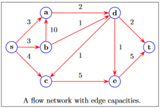
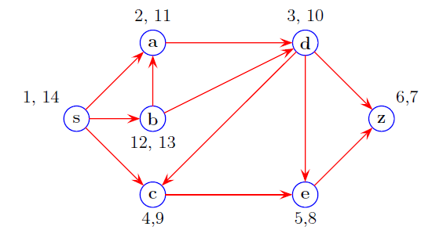
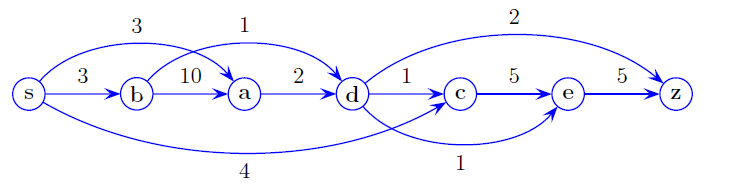

| Date         |
| ------------ |
| Nov 28, 2022 | 

# Shortest Paths in DAGs

> There are no cycles in a DAG this means we can employ a faster algorithm than Dijkstra's Shortest Page algorithm.

Consider that DAG.

## Step 1: Perform a DFS with Pre/Post

## Step 2: Order with Lowest to Highest Post Number

$$
\{s, b, a, d, c, e, z\}
$$

## Step 3: With (2) recreate the edges

Notice that there will **only** be:
+ Cross edges (edges between siblings)
+ Forward Edges (ancestor to grand...child)

## Step 4: Reverse The graph and find adjacency list

Lets call this reversed graph $E^R$

Adjacency List:

$$
\begin{align}
E^R[s] &\to [    ]\\
E^R[b] &\to [s   ]\\
E^R[a] &\to [b, s]\\
E^R[d] &\to [a, b]\\
E^R[c] &\to [d, s]\\
E^R[e] &\to [c, d]\\
E^R[z] &\to [d, e]
\end{align}
$$

## Step 5 Find Shortest path from $s$ to another node

- $\text{dist}(v)$ = shortest path from $s$ to $v$

### 5.1

Initially:

$$
\text{dist}(s) = 0
$$

and $\forall u\in E, u\neq s$

$$
\text{dist}(u) = \infty
$$

### 5.2

$$
\text{dist}(v) = \min_{u\in E^R[v]}\biggr( \text{dist}(u) + w(u, v) \biggr)
$$

Here is what this says:

For any node $v$ , the shortest distance from $v$ to $s$ is really just the minimum of the weight to travel to a child of $v$ , call it $u$ , and the the minimum distance of $u$ to $s$ .

## Worked Example

Lets use this graph. 

Since $\text{dist}(s) = 0$ lets start with $b$ .

$$
\text{dist}(b) = \min\biggr(\text{dist}(b), \text{dist}(s) + w(s, b)\biggr) = \min(\infty, 3) = 3
$$

Thus we now have the following data:

| **DIST**   | 0   | 3   | $\infty$ | $\infty$ | $\infty$ | $\infty$ | $\infty$ | 
| ---------- | --- | --- | -------- | -------- | -------- | -------- | -------- |
| **VERTEX** | s   | b   | a        | d        | c        | e        | z        |

Continue with node $a$ :

$$
\text{dist}(a) = 
\min\biggr(
\text{dist}(a), 
\text{dist}(s) + w(s, a),
\text{dist}(b) + w(b, a),
\biggr) = \min(\infty, 13, 3) = 3
$$

| **DIST**   | 0   | 3   | 3   | $\infty$ | $\infty$ | $\infty$ | $\infty$ |
| ---------- | --- | --- | --- | -------- | -------- | -------- | -------- |
| **VERTEX** | s   | b   | a   | d        | c        | e        | z        |

Continue with node $d$ :

$$
\text{dist}(d) = 
\min\biggr(
\text{dist}(d), 
\text{dist}(a) + w(a, d),
\text{dist}(b) + w(b, d),
\biggr) = \min(\infty, 5, 4) = 3
$$

| **DIST**   | 0   | 3   | 3   | 4   | $\infty$ | $\infty$ | $\infty$ |
| ---------- | --- | --- | --- | --- | -------- | -------- | -------- |
| **VERTEX** | s   | b   | a   | d   | c        | e        | z        |

This goes on resulting in:

| **DIST**   | 0   | 3   | 3   | 4   | 4   | 5   | 6   | 
| ---------- | --- | --- | --- | --- | --- | --- | --- |
| **VERTEX** | s   | b   | a   | d   | c   | e   | z   |
