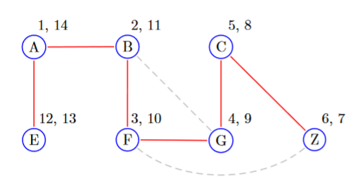

# Depth First Search

> When we have to make a decision about what node to pick next (or initially) choose alphabetically

This will be not a huge note since I have "learned" DFS many times however this class's spin on DFS is different. 

Regular DFS:
```python
S     = getStart(G) # Pick Starting Node
Seen  = set()       # set of seen nodes (initially S)
Stack = [S]         # regular stack

while not Stack.isEmpty():
	node = Stack.pop()
	# process this node here
	for child in node.children:
		if child not in Seen:
			Stack.add(child)
			seen.add(child)
```

However in each class each node has additional data attached to it: 
+ `pre` - when the node first entered the stack
+ `post` - when the node exited the stack

## Pre, Post Example



- Dashed Lines: untraveled edges
- Red Lines: traveled path

Each node in the image has a $(\text{pre}, \text{post})$ as defined above. We started at $A$ but it was the last to exit so it receives $(1, 14)$ .

Notice that nodes with $(\text{pre}, \text{post}) = (k, k+1)$ are leaves. They entered the stack and left on the next iteration. 


Runtime: $O\biggr(|E| + |V|\biggr)$