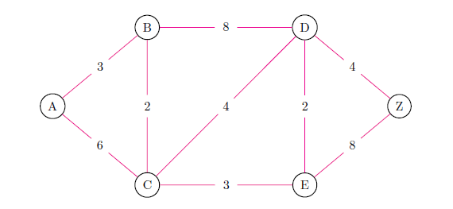
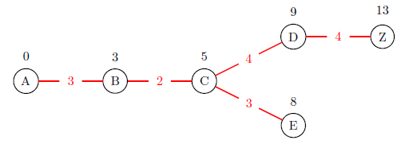

# Dijkstra's Shortest Path Algorithm

After picking a starting node, all distances are $\infty$ .

Start Node: $A$

This means:

|              | A   | B        | C        | D        | E        | Z        |
| ------------ | --- | -------- | -------- | -------- | -------- | -------- |
| Min Distance | 0   | $3_A$ | $6_A$ | $\infty$ | $\infty$ | $\infty$ | 

Since the minimum distance generated was $A\to B$ , that edge is added and we move to $B$ . 

Neighbors of $B = \{\not A, C, D\}$

We update the table by updating the Min Distance between $u$ and $B$ for $u$ a neighbor of $B$ with:

$$
\text{cost}(u) = \min\{\text{cost}(B)+\text{cost}(B\to u), \text{cost}(u) \}
$$

|              | A   | B             | C     | D        | E        | Z        |
| ------------ | --- | ------------- | ----- | -------- | -------- | -------- |
| Min Distance | 0   | $\boxed{3_A}$ | $6_A$ | $\infty$ | $\infty$ | $\infty$ |
| Min Distance | 0   | -             | $5_B$ | $11_B$ | $\infty$ | $\infty$ |

By the  same logic we select $C$ to be the next traveled node. 

This is the completed table:

|              | A   | B             | C             | D             | E             | Z        |
| ------------ | --- | ------------- | ------------- | ------------- | ------------- | -------- |
| Min Distance | 0   | $\boxed{3_A}$ | $6_A$         | $\infty$      | $\infty$      | $\infty$ |
| Min Distance | 0   | -             | $\boxed{5_B}$ | $11_B$        | $\infty$      | $\infty$ |
| Min Distance | 0   | -             | -             | $9_C$         | $\boxed{8_C}$ | $\infty$ |
| Min Distance | 0   | -             | -             | $\boxed{9_C}$ | -             | $16_E$   |
| Min Distance | 0   | -             | -             | -             | -             | $\boxed{13_B}$   |

## Spanning Tree 

This is generated from the table above since we have each of the $\text{parent} \to \text{child}$ relations. 

## Runtime
Notice each node is visited. Then each edge is kept in memory so we can pick the smallest one to add to the spanning tree. This is done via a heap[^1]. Each time an edge is seen we add it to the heap. 

The worst case runtime is:

$$
O\biggr(|E| \log{ |V| }\biggr) = O\biggr((|E|+|V|)\log{ |V| }\biggr)
$$

> **Note**: $|E| \leq |V|^2$

There only needs to be $|V|$  heap nodes. They keep track of the minimum distance to *that* node. 
 
[^1]: [[01 - Heap Sort and O(n) Heapify]] 