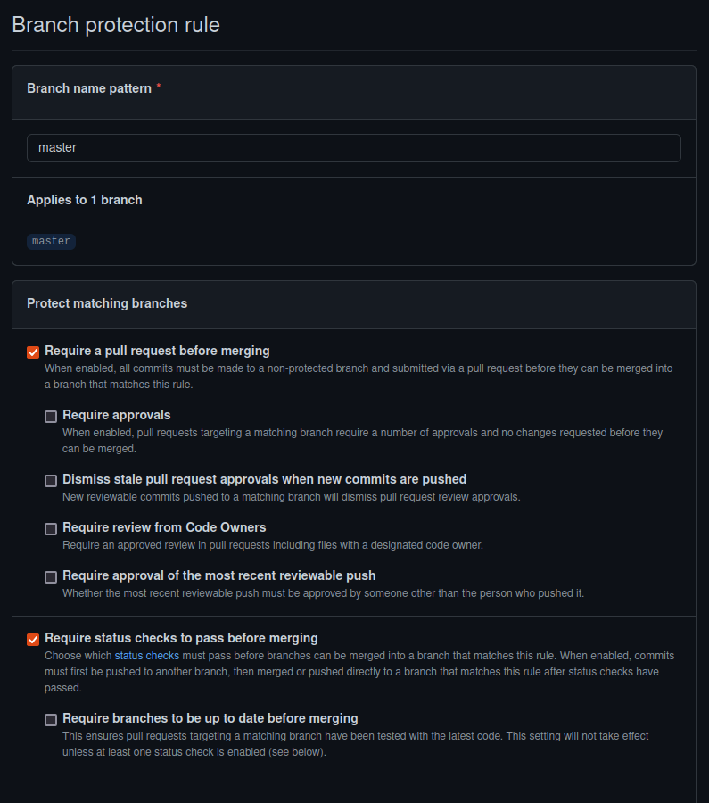
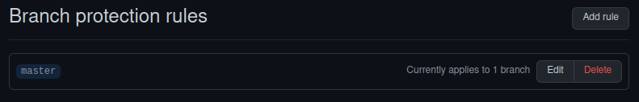
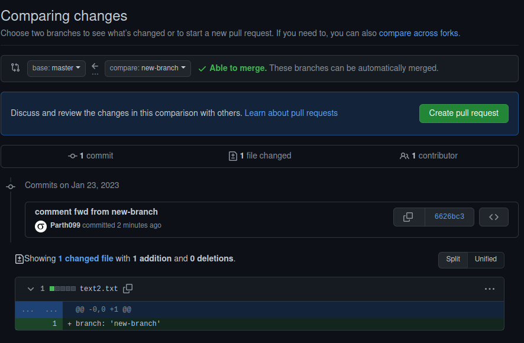
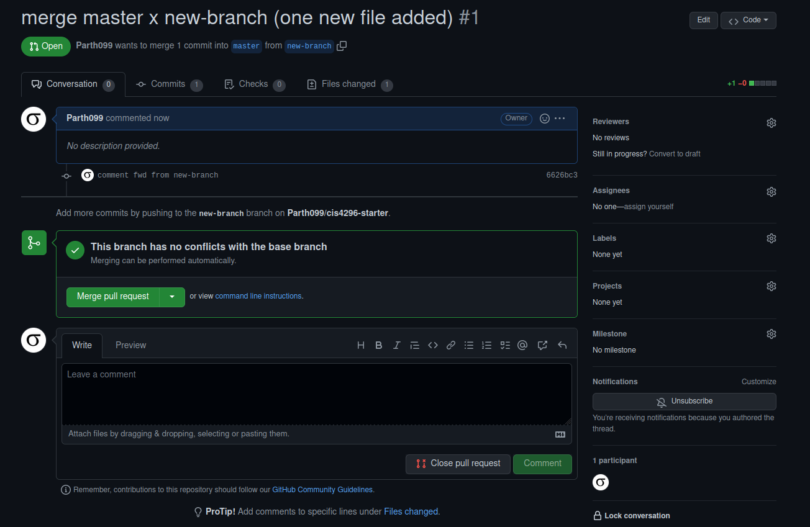
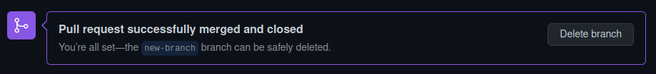
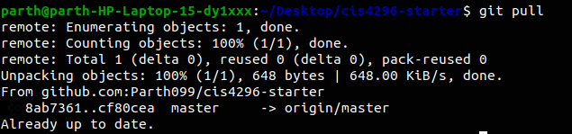

# Lab 1 - GIT

Github Link: [Parth099](https://github.com/Parth099/cis4296-starter)

Creating Protection Rule:

This rule was created:

**New branch creation**:

Pull request made:

Successful merge:

Successful Pull Post-merge:

