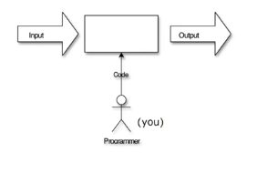

# Lecture January 17th 2023

> Should be able to contribute to projects in `Java`.

## Programming Vs. Software Development
### Programming
***Input Output Model***: All computing can be represented as transforming **input data** into **outputs**. 

***Evaluation***:
+ Speed
	+ $O(f(n))$
	+ TPS (transactions per second)
+ Memory Usage
+ Precision/Recall

### Software Development

+ Multiple People working on one project

***Evaluation***:
+ Fit for purpose (how happy is the client)
+ Usability (how hard is it for a person to use)
+ Cost 
+ Delay

Programming is defined to be primarily a solo venture while *software development* is a team activity. The range of programming encompasses writing a fill program whilst *software development* ranges the full life cycle:
+ design
+ testing
+ maintenance

In the end **Software Development** is writing a set of programs to solve business requirements whilst **Computer Programming** is writing a sequence of instructions to transform input into (desired) output. This means the that evaluation criterion is different. *Programming* may be defined by how well the program runs[^1] while software development may concern itself with solving the problem at hand (fit for  
purpose). 

[^1]: $O(f(n))$