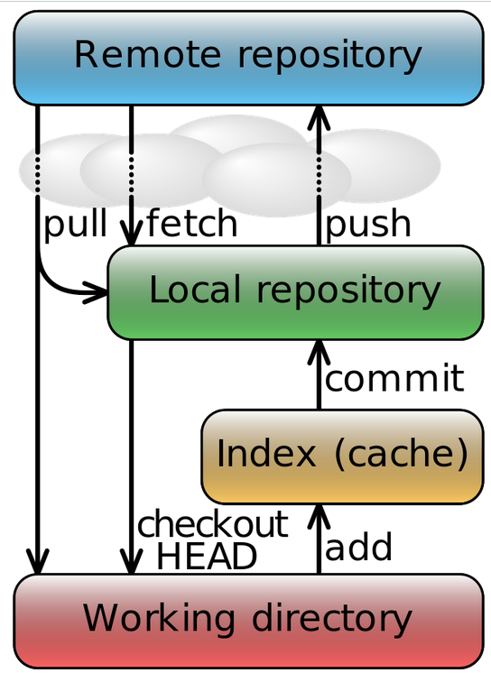

# 01 24 23
## Version Copy
1. Centralized
	+ Keep master copy on a central server 
	+ Prone to server failure
	+ Developers pull / commit from/to a central server. The commits are made **directly** to the server via a network[^1]. 
2. Distributed
	+ repository is distributed (cloned on each developer's system)
	+ Developers can commit offline (see above bullet on why)
	+ When developers push a change they are really pushing to each other's repos.  

## GIT: Local Repo vs Remote Repo

A local repo is on *your* computer. Changes are staged and stored here. Other operations like branch creations are also supported here. 

A Remote Repo is a repository stored on a remote server. This repo is updated when a developer pushes their code from their local repository. A `git clone` will copy the remote repo onto your machine and create a local repo. 

## GIT Data Flow



### `git pull` and `git fetch`

> `git pull` is a combo of `git fetch` + `git merge`

When `git fetch` the changes from the remote repo is downloaded to your local repo, **but** it **does not** merge the changes onto your local branch[^2]. 

`git merge` is a used to combine changes from multiple branches into a single branch. It compares the current branch and the target branch and finds the differences. If no conflicting changes are made a `fast-forward merge` is made: it moves the current branch to the latest commit in the target branch. 

> A conflict occurs in Git when two or more branches have made changes to the same line(s) of code in a file.

If a `fast-forward merge` is **not possible**, another commit is made to resolve the merge conflicts. A developer must go over the list of changes and accept/reject changes that the branches have in them. For example:

```shell
# Branch MAIN
(line 6) x = 17;

# Branch C
(line 6) x = 67;
```

This change from C to main must be rejected or accepted via some IDE. 

To make this change[^3]:
```shell
git checkout MAIN
git merge C
# resolve conflicts via ide or edit the conflicting files
```


[^1]: This means that devs must be on a network to keep writing code. 
[^2]: currently checkout-ed branch
[^3]: I want to merge C into MAIN