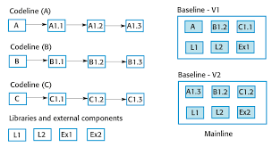
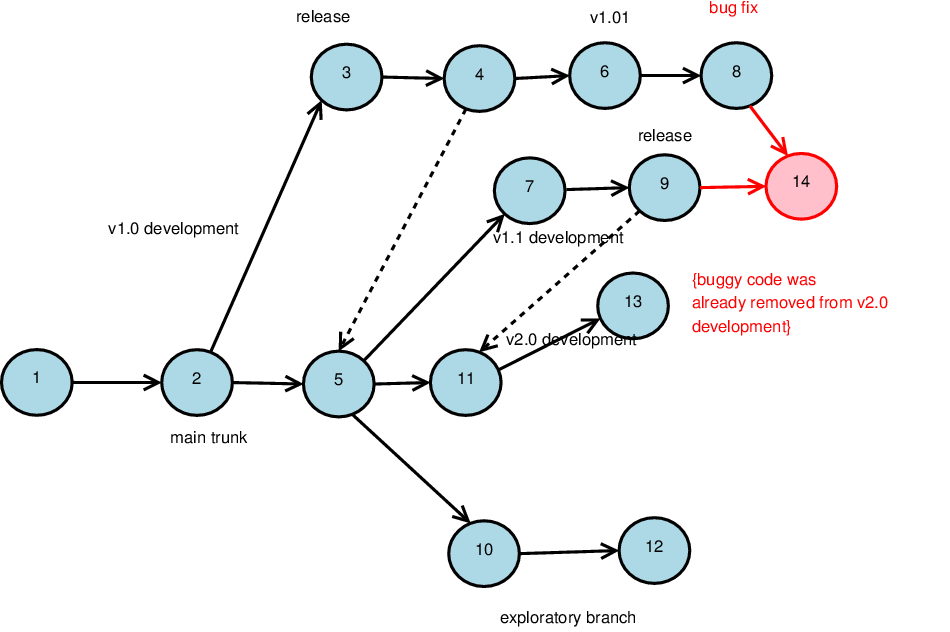

# January 26th 2023

# Configuration Management (CM)
+ Each version of a software has to be maintained and managed
+ Versions implement proposals for change, corrections of   faults, and adaptations for different hardware and   operating systems.
+ CM is concerned with the policies, processes, and tools for managing changing software systems.  

## Activities
1. Change Management - Keeping track of **requests** for changes from customers and developers. Also deciding which changes to implement.  
2. Version Management - involves keeping track of the different versions of software components as changes are made to them.
3. System Building - process of assembling program components, data, and libs, then compiling these to create an executable system.
4. Release Management - Preparing software for external release and keeping track of versions that have been released for customer use.

## Vocab
0. Configuration item (CI) or software configuration item (SCI)
	+ Anything associated with the software project.
	+ There are often different versions of a configuration item.
	+ Configuration items have a unique identifier.
	+ A CI/SCI is any component that needs to be managed in order to deliver an IT service.

> There is no discernible difference between CIs and assets

1. Configuration control
	+ The process of ensuring that versions of systems and components (all versions) are record, maintained,and stored for the lifetime of the system.
2.  Version
	+ Instance of a configuration item that differs from its other instances. They are often identified by a configuration item name plus a version number.
3. Codeline
	+ Set of versions of a software component and other configuration items on which that component depends.
4. Baseline (derived from `codeline`)
	+ A collection of components that make up a system. Baselines are controlled, this means the components cannot be changed. 
	+ A baseline is a definition of a specific system.
	+ The baseline therefore specifies the component versions that are included in the system plus a specification of the libraries used, configuration files, etc.
5. Mainline
	+ A sequence of baselines which represent different versions of a system
6. Release
	+ A version of a system that has been released for customers
7. Workspace
	+ Private space software can be "work"-ed on that will not effect other developers. 
8. Branching
	+ Creation of a new code line from a version in a existing codeline. 
	+ The new codeline and the existing codeline may then develop independently.
9. Merging
	+ Creation of a new version of a software component by merging separate versions in different codelines. 
10. System Building
	+ The creation of an executable system version by compiling and linking the appropriate versions of the components and libraries making up the system.

**Graphic**: For Codelines, Baselines, and Mainlines



A baseline can be specified using a configuration language, which allows you to define what components are included in a version of a particular system.

If needed codelines can be merged to include all the changes made in prior versions. 



+ Dotted lines are changes synced to the main line of the code (release)
+ The <span style="color:red;">14</span> also represents the merging to branches

> Each branch is a codeline


## Factors in Change Analysis
1. Consequence of not making the change
2. Benefits of the change
3. number of users effected by the change
4. cost of change
5. product release cycle

## Change Management and Agile
1. Some agile methods customers are present
2. They Propose a change to the requirements and work with the dev team to analyse the factors of change above.
3. The changes to software that improve the software are done solely by developers

## Version Management
The process of keeping track of different versions of software(s) and the changes of different developers. 

> Managing codelines and baselines

Version numbering:
```text
7.4.5

7 - Customer Release
4 - Small Features (dev)
5 - Bug Fixes (dev)
```