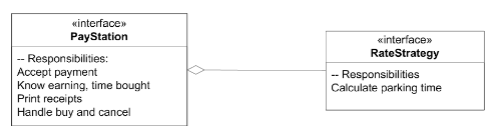

# January 31st 2023
Consider the product requirements

## Requirements by Alphatown
A customer wants a *paystation*:
+ Accepts coins
+ shows time bought
+ prints receipts
+ handles buying and canceling
+ maintenance

**The cost** of the paystation is $2 \min /\ 5 \text{ cents}$ .

> This type of rate will be called the *Linear Rate*.

## Scenario
A new town *Betatown* comes in and says they want the same thing but with a progressive price model:

+ Hour 1: $2 \min /\ 5 \text{ cents}$
+ Hour 2: $1.5 \min /\ 5 \text{ cents}$
+ Rest: $1 \min /\ 5 \text{ cents}$

> How to implement this change whilst keeping both machines working?

> This type of rate will be called the *Progressive Rate*.

## Trivial Solutions (1) and (2)
### Solution 1
1. Fork Alphatown's Paystation
2. Make changes relevant to Betatown
3. Throw away entire test unit since we made a change to the core code

### Solution 2
When accepting coins and calculating the time bought use a `if`-statement to decide rate.

## Solution 3 - Polymorphism
Instead of (1) and (2), we can have a core `PayStation` Interface and override the payment calculation.

The issue here is that:
+ too many classes if more towns want our product
+ The Inheritance relation is spent on a single variation
+ The code is hard to reuse between variations
+ Compile-time binding
	+ This means that once the program starts running the rate type cannot be altered

Suppose some *Gammatown* comes in and says they want:
+ Weekdays: Alphatown Policy
+ Weekends: Betatown Policy

It would be odd to extend $\alpha$ and $\beta$ yet use the same code. 

## Solution 4 - Compositional

> "No abstraction should have too many responsibilities. Max 3 is a good rule of thumb."

Notice the Paystation class currently has the following responsibilities:
1. Accepting Payment
2. Calculating Payment based on a policy
3. Printing Receipts
4. Handling Cancel / Buy / Empty

Lets remove (2) and create a new `class` to process payment policies. 



The principle of asking another object for help is called "**Delegation**".


Now the only issue is telling the class what payment strategy to use. 

Here is one method:

```java
//internal class variable
private RateStrategy rateStrategy;


//Assign a policy via constructor
public PayStationImpl( RateStrategy rs ) {  
	rateStrategy = rs;  
}
```

However this still seems like compile time binding!

You can create a `set`-method to change it **during run-time**.

```java
public updateRateStrategy( RateStrategy rs ) {  
	rateStrategy = rs;  
}
```

Now there is only once place in the code where all the core policy types exist. 

## Summary
+ Change via addition, **not modification**
+ Addition
	+ Little to test
	+ Less change of ripple effects

