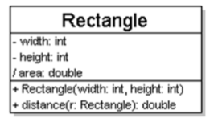
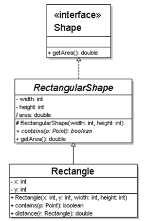
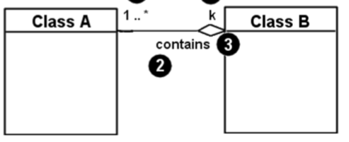
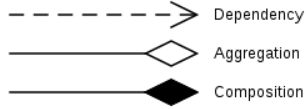

# UML Diagrams

## Preface

> In terms of classes and objects, an object is a member or an "instance" of a class. **A class is a template for objects**.

The **design phase** specifies the structure of *how* a software system will be written and function without writing out the code. 

This is a transition from the *analysis* state where the "what will the system do" will be answered. 

## Designing Classes
From the design specs it is often found that the nouns represent classes while the verbs represent the methods. 

## UML
> A picture of a Object-Oriented System

### Uses for UML
+ as a sketch: to communicate aspects of system
	+ forward design (before implementation)
	+ backward design (post implementation as documentation)
+ as a blue print
+ as a programming language 
	+ some tools can generate code based on UML code. 

## UML (Cont.)

> UML – Unified Modeling Language

In a model lines between "boxes" represent relationships and references. Each box can have a Object Name (along with its type) and some attributes. 

There are a few conventions for classes and attributes:
+ If the class is an `interface` write `<<interface>>` about it
+ Abstract classes are written in *italics*
+ Attributes (prepend with attribute name)
	+ They are labeled based on visibility
	+ `+` public
	+ `#` protected
	+ `-` private
	+ `~` package
	+ `/` derived
	+ static variables are <u>underlined</u>

**Example of a UML Class**



Conventions for Methods:

```
[visibility] [name](params): ret_type
```

+ visibility
	+ `+` public
	+ `#` protected
	+ `-` private
	+ `~` package
	+ static methods are <u>underlined</u> 

Example:
```typescript
dist(p1: Point, p2: Point): double
```

## Relationships between Classes
### Generalization
> an inheritance / interface  relationship



+ hierarchies drawn top-down; arrows point upward to parent

> Notice how *RectangleShape* implements Shape

The line+arrow combo indicates whether parent is a: 
+ class : solid line, black arrow
	+ Ex: `⸻▶`
+ abstract class: solid line, white arrow
	+ Ex: `⸻>`
+ Interface: dashed line, white arrow	
	+ Ex: ` - - >`

## Associational (Usage) relationships
### Multiplicity
+ `*` : 0 or more
+ `1` : 1 exactly
+ `2..4`: 2 to 4 inclusive
+ `3..*`: 3 or more



Class A contains at most $k$ instance of $B$ but atleast 1.  You read from the box without the diamond to the box with the diamond conjoining with *contains*. 

### Association types

> **Aggregation** and **Composition** are subsets of association



+ Aggregation: "is a part of"
	+ relationship where the child can exist independently of the parent
	+ Example: School and Student Objects
+ Composition: "is entirely made of"
	+ Example: Room and House Objects
+ Dependency: "uses temporarily"
	+ Often an implementation detail not a intrinsic part of the object's state
	+ Example: CarFactory and Car. The CarFactory class depends on Car yet Car does not require CarFactory to be defined. 
	+ Generally, Class A depends on Class B if a change in B will effect A. 