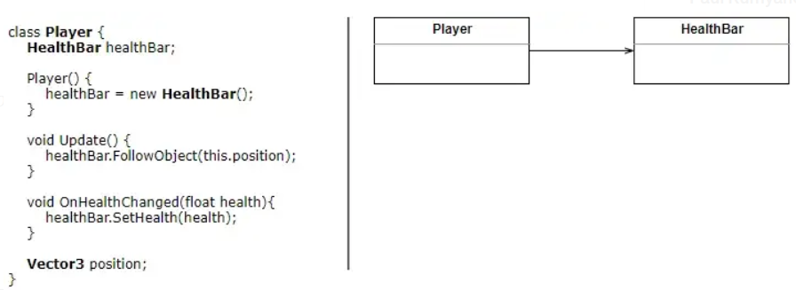

# UML Detailed
## Preface
Recall the following:
+ Generalization: "is a"
	+ Class: solid black arrow (black = filled in)
		+ "extends"
	+ Abstract class: solid white arrow
		+ "extends" (abstract)
	+ Interface: dashed white arrow
		+ "implements"
+ Association: "has a"
	+ aggregation: "is part of"
		+ connection: white diamond
	+ composition: "is entirely made of"
		+ connection: filled in diamond
	+ dependency: "uses temporarily"
		+ connection: dashed arrow, head filled in

## Reading UML Diagrams
### Generalizations (Inheritances)

The arrows can be read by adjoining "implements/extends". It flows from the class that implemented/extended to the class that needs to be implemented/extended. 

### Associations
#### Creation and Reading
Consider the following and relationship. 

The association arrow is "backwards". It goes from Parent to Child. The arrow represents **navigability**. It shows the direction of the relationship. The implementation of player "uses" health bar. 

#### Aggregation: Child can exist without Parent

This reads `Player` uses `HealthBar`. The diamond is located with the parent. 

> See *Composition* (below) to see how to place the diamond.

#### Composition: Child cannot exist without Parent

Since either cannot exist without each other they utilize a black diamond. 

The diamond is placed on the end of the line that points to the class that **represents the whole** or container. This is also true for *Aggregation*.

#### Dependency
This is a weak relationship. It is used when a method parameter is another class.

Suppose one of the methods in `Player` received the current time as an argument. 

## Summary
This is **a lot** to remember. 

+ For classes the arrow should flow in such a way that the class names adjoined with "implements" makes sense.
	+ Example: `Circle` implements `Shape` (interface).
+ The Association arrow points from the object using an object to the used object
+ The Aggregation / Composition diamonds shall be made in such a way that the diamond is closer to the object using the other object. The used object should be on the other side of the diamond. 
+ Dependency works the same way as the Association arrow. 

### Steps to Creating a Class Diagram
1. Find New Objects
2. Iterate on Names, Attrs, and methods
3. **Find Associations between objects**
4. Label Associations
5. Determine  multiplicity of the associations
6. Find other relations (inheritance, implements, extends, ...)