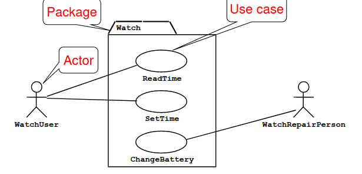
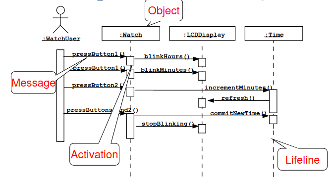
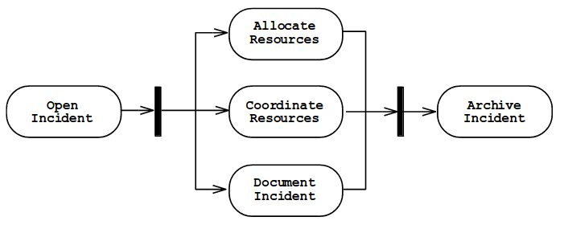

# UML Cont.
<!-- sigh -->

## Preface
+ Use Case Diagrams
	+ Describe the functional behavior from the **POV of the User**.
+ Class Diagrams
	+ Describe the static structure of the system
		+ Objects, Attributes, and Associations
+ Interactions Diagrams
	+ Describe the dynamic behavior between actors, the system, and objects used. 
+ State Machine Diagrams: finite state automaton
+ Activity Diagrams
	+ Model the dynamic behavior of a system (flowchart)

## Quick Pass
### Use Case Diagrams



Use case diagrams are used to represent the functional requirements of a system at a high-level by breaking down actions via actors. 

In this system only the `User` needs to be able to change/read the time. 

### Class Diagrams
What we have been doing in the other lectures.

### Sequence Diagrams



The horizontal lines represent lifelines and activation. They represent the runtime of that function/object, it shows when the object/method exists/runs in memory.

It is used to describe the flow of data between functions and objects

### Activity Diagrams



It is used to describe the steps in a process or the flow of control in a system, and it is especially useful for modeling the dynamic behavior of a system.

More on these in their own note. 


## Details
The details of each of these can be located in the folder:

```shell
./UML
```

Obsidian Links:
+ [[01 - Use Case Diagrams]]