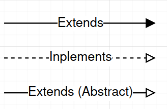
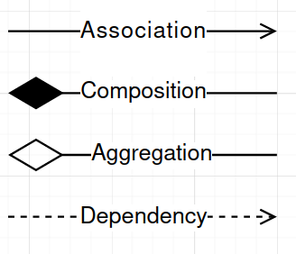

# Midterm Review

> Not part of class

## Class Diagrams
+ If a class is abstract the name is in *italics*
+ If a class inherits methods they **do not** need to be included. 

**Variables**
`+` - Public
`-` - Private
`#` - Protected
`~` - Package
`/` - Derived
Any static variable is **underlined**. 

The methods follow the same rules but there are no "derived" methods. 
Methods are written in the following manner:

```python
distance(p1: Point, p2: Point): float
```

### Inheritance Relationships 



In the direction of the arrow it should read "extends/implements"'[^1].

> Inheritance relations **DO NOT HAVE** multiplicity. 

### Association Relationships



The arrows from A $\to$ B should read: "A uses B". 

The diamonds from A $\to$ B should read "A consists of B". [^2]
+ Composition is used when object A will not exist without B and B cannot exist without A.
+ Aggregation is used when A and B can exist without each other. Aggregation is more so "is part of".

#### Multiplicity
On each end of the arrow used above there is a "Multiplicity". 

This can be a strict number like $2$ or a range:
+ A `*` represents 0 or more
+ A `a..b` represents $a$ to $b$ (*inclusive*)
+ A `a..*` represents $a$ or more.


[^1]: Depends on if its an interface or class extension
[^2]: The diamond is on the side of A which should be the parent (object that contains the other one)