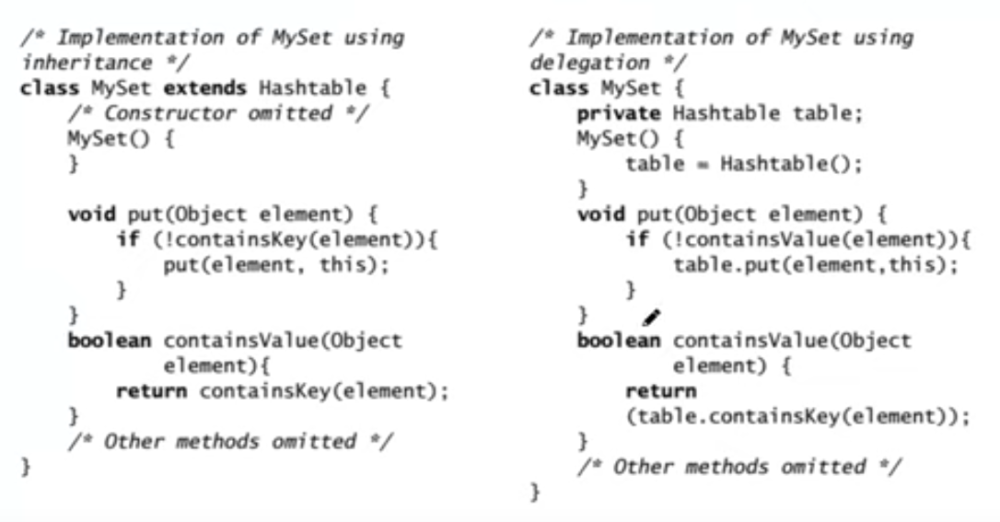

# Intro to Design Patterns
## Inheritance Meta-Model
+ Taxonomy
	1. Inheritance Detected via specialization
		+ You realize you need children classes to handle special behaviors
	2. Inheritance Detected via generalization
		+ When developing classes you realize they all share something so you make a parent class
+ Inheritance for Reuse
	1. Specification Inheritance
		+ When the child is a subtype of the parent. Ex: Parent=Bird, Child=Duck,Sparrow
		+ Specification inheritance defines what a class can do, but not how it does it (interfaces).
	2. Implementation Inheritance
		+ Child class inherits both the method signatures and the implementation of the parent class.

## Delegation 
Delegation is about off loading responsibilities onto another object while the class focuses on completing its own given task. 



In this case, delegation is the better version: Changes in the inheritance model of `Hashtable` will force a developer to also change `MySet`. 

Notice that since `MySet` is **not** a subtype of `HashTable` under delegation, it cannot be substituted for `HashTable`. This is good news since changes to `MySet` may break code if for example any `HashTable` methods are overridden and cause breaking changes if used as:

```java
HashTable HT = new MySet();
```

**However**, specification inheritance is still preferable than delegation for subtype relations as it leads to better extendability. 

## Principle of Least Knowledge

Similar to the Law of Demeter in [[03 28 23 - Coupling and Cohesion]]

> reduce the interactions between objects to just a few close 'friends'

