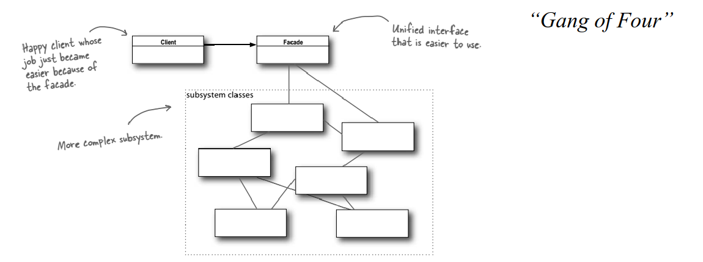

# Design Patterns
Types:
1. Creational - Instantiate Objects given certain conditions
2. Behavioral - Control communication between objects
3. Structural - Create Interfaces around/between objects

# Adapter and Facade
## Facade
> This is used to keep track of a lot of active classes. 

> Instead of making your code work with dozens of the framework classes directly, you create a facade class which encapsulates that functionality and hides it from the rest of the code.

A Facade abstracts the complex relations by exposing methods that represent operations between. Its goal is to make the subsystem easier to use. 

## Adapter (aka) Wrapper
> **Adapter** is a structural design pattern that allows objects with incompatible interfaces to interact. 

The **Adapter** converts the interface of one the objects involved so the other object can understand it. This is done to reduce the coupling factor involved with converting the first object.

Here is how it works:
1. The adapter gets an interface compatible with one of the existing objects
2. Using this interface the existing object can call the adapter's methods
3. Upon receiving the method call the adapter changes the format, in a way the other object understands and pass it on.

