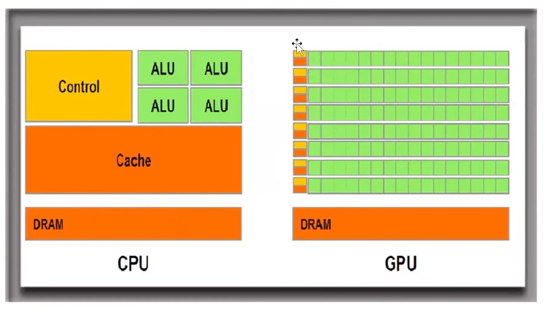
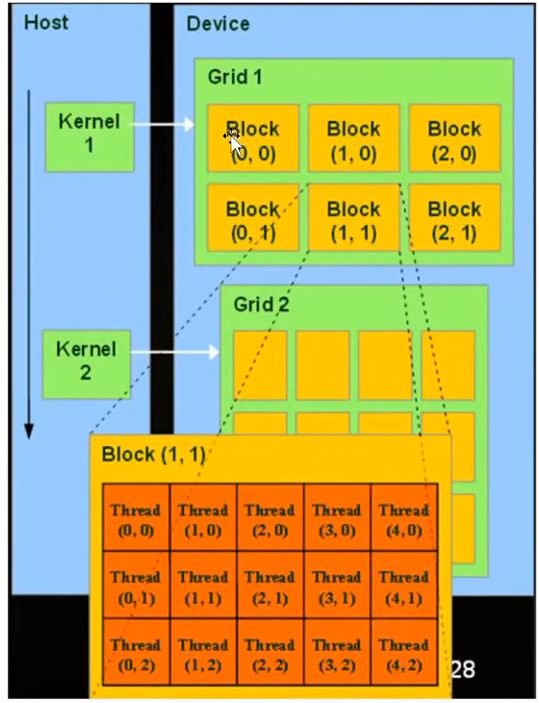
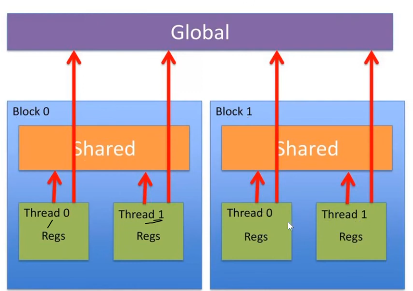

# MPI - Message Passing Interface
## MPI API

Methods are listed here without argument headers.

```c
MPI_INIT      // used to open socket connections
MPI_Comm_size // get num processors
MPI_Comm_rank // get rank (id) or current machine
MPI_Bcast     // share a value to all worker nodes
MPI_Send      // send a value to a specific (maybe set) node
MPI_Recv      // receive a value from a specifc tag and save it
MPI_Reduce    // 
MPI_Finalize  // close socket connection
```

When using `MPI_Send` you specify a `MPI_TAG` that is used later for your purposes. 

When a message is read from `MPI_Recv`, a struct is also read with tag related information:
```c
typedef struct MPI_Status {
    int MPI_SOURCE;   // rank of source
    int MPI_TAG;      // message tag
    int MPI_ERROR;    // error code (if any)
    // implementation-specific fields
} MPI_Status;
```

# GPU Programming
## SIMT - Single Instruction Multiple Thread
This is when threads on a GPU perform the same instruction via threads on different pieces of data. These threads are organized into "warps" where each thread is executing the same instruction but on a different part of the input. When a branch in the code is hit each thread is executed serially until they paths re-converge.  

## CPU vs GPU
1. CPUs have a few cores optimized for serial processing
2. GPUs have a lot of small cores designed for parallel performance
3. Serial Portions of code run on the CPU while parallel portions run on the GPU

Cartoon Architecture Image:



## Running GPU Code

**Running GPU Code:**


See that each block above has a "warp". 

In this image the host is the CPU (where the code is) and the device is the GPU. The code needs to inform of its thread and block usage to run.

The flow:
1. Copy input from CPU memory to GPU memory
2. Load GPU program and run 
3. Copy result to CPU memory

Code designated to run on the CPU/GPU in CUDA programming is preceded with special characters. The CPU will get the call to use the GPU and execute it on the GPU, however, when using the GPU the function call must tell the CPU how many threads and how many blocks to use via the following syntax:

```c
function_name<<<num_blocks, threads_per_block>>>(...args)
```

The reason why there exists blocks is because memory is shared on a block basis. 

### Code
Much like above there are specific code syntax you need to follow to code on the GPU. 

For example a function declared as `__global__` is known as a kernel function to be executed on the GPU. Threads in a single block are assigned to a single GPU code while also sharing the same memory region.[^1]



#### SIMT Code
1. Map a grid over some domain
2. each thread in this grid executes a kernel function
	+	Each thread belongs to some block
	+	Each block has vector groups called "warps" (the unit in SIMD)
3. Threads distinguish computation by querying their grid/block location 
	+ the location of a thread inside a block and grid can serve as its `id` since it will be unique. 

<!-- 55.19 / 1.16.16 -->

#### Examples
> Since i cannot run the code there is no guarantee it is correct. 

##### Add
```c
# pointers since we need to move vars to device (GPU) memory initially.
__global__ void add(int *a, int *b, int *c) {
	*c = *a + *b;
}


int main(void){
	int a, b, c;           // host variables
	int *d_a, *d_b, *d_c;  // device copies
	
	int size = sizeof(int);
	
	//allocate space for device copies for a, b, c
	cudaMalloc((void**)&d_a, size);
	cudaMalloc((void**)&d_b, size);	
	cudaMalloc((void**)&d_c, size);
	
	// testing values
	a = 2; b = 7;
	
	// copy values to device
	cudyMemcpy(d_a, &a, size, cudaMemmpyHostToDevice);
	cudyMemcpy(d_b, &b, size, cudaMemmpyHostToDevice);
	
	add<<<1, 1>>>(d_a, d_b, d_c); //run kernal function
	
	cudaMemcpy(&c, d_c, size, cudaDeviceHostToHost);
	
	cudaFree(d_a); cudaFree(d_b); cuda(d_c);
	
	return 0;
	
}
```

##### Vector Add
```c
// not working code just for sake of example
__global__ void add(int *a, int *b, int *c) {
	int tid = blockIdx.x * blockDim.x  + threadIdx.x
	// n is the size of the vector
	while(tid < n) {
		c[tid] = a[tid] + b[tid];
		tid += blockIdx.x * blockDim.x;
	}
}
```

[^1]: Thats why they are threads. 