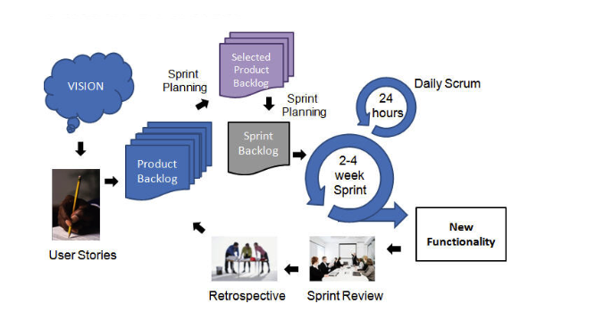
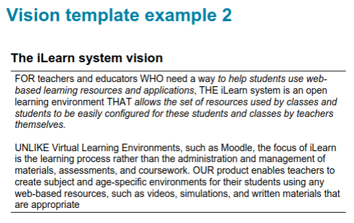

# Intro to Scrum
+ iterative methodology: Project progresses iteratively
	+ iteration unit: sprint (2-4 weeks long)
	+ Team size: 5 to 9 people 

## Product Vision
The starting point of any product is a `Product Vision`, it shortly describes what is to be developed and target customers. 

It should answer the questions:
1. What is the product?
2. Who are the target users?
3. Why should customers buy this product?

### Moore’s vision Template
`FOR` (target customer)
`WHO` (statement of the need or opportunity)

The `PRODUCT` is a `PRODUCT_CATEGORY` that `KEY REASON TO BUY` unlike `ALT_MARKET_PRODUCTS`, our product `KEY differentiation`.

Example from slides:

## Personas
> Personas are ‘imagined users’ where you create a  character portrait of a type of user that you think might use your product. They should describe their educational background, technology experience and why they might want to use your product. 

Personas are nothing more than users that will help you think of what your target customers might want to do with your product. It should include background details like: 
1. Why they might want to use your product
2. Educational/Technical Background
3. Job-related Information

## Feature
`TODO`

