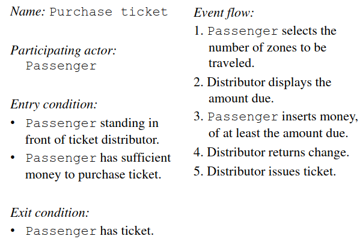
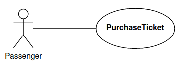
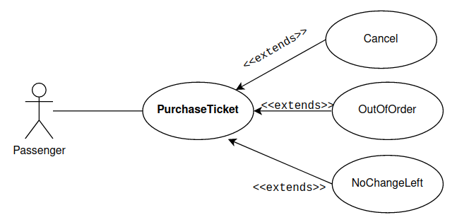
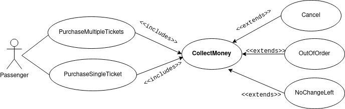

# Use Case Diagrams

## Preface
+ Rectangles are classes or instances
+ Ovals are functions or use cases
+ Instance of a class are denoted via underline

## Use of the Use Case Diagram
+ Specify the context of a system
+ Capture the requirements
+ Generate Test Cases
+ Developed by *domain experts*

## The Diagram
### Use Cases
Consists of:
+ Unique Name
+ Participating actors
+ Flow of Events, Entry/Exit conditions
+ Special requirements

### Example

---

### Relationships
#### `<<extends>>`[^1]

The `<<extends>>` relationship represent exceptional cases. They are **factored out** of the main case for clarity. 

> Watch the direction of the relationship. It should read "A" extends "B" in the direction of the arrow. 

#### `<<includes>>`[^1]

The `<<includes>>` relationship represents behavior that is factored out of the use case because it can be reused. 

> Watch the direction of the relationship. It should "A" includes "B" in the direction of the arrow. 

[^1]: Think about interfaces and `@override`