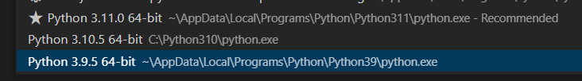
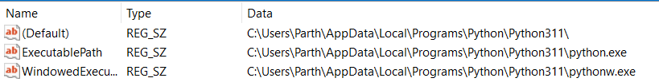
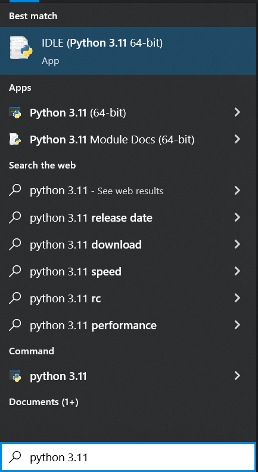
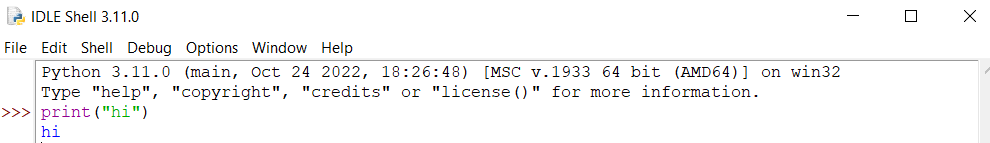

# Week 10 Discussion - Registry Keys
Instead of working on just one registry key I decided to answer using the windows registry the following question:

> How do code editors like `VSCode` see the different versions of python I have installed? 

For this discussion I installed Python $3.11$ :



## Relevant Registry Paths

Path to versions $3.10$
```txt
Computer\HKEY_LOCAL_MACHINE\SOFTWARE\Python\PythonCore\

Computer\HKEY_LOCAL_MACHINE\SOFTWARE\Python\PythonCore\3.10
```

Path to versions $3.9, 3.11$
```txt
Computer\HKEY_CURRENT_USER\SOFTWARE\Python\PythonCore\

Computer\HKEY_CURRENT_USER\SOFTWARE\Python\PythonCore\3.9
Computer\HKEY_CURRENT_USER\SOFTWARE\Python\PythonCore\3.11
```

The question here is that aren't they all under one sub key?
The answer is that for version $3.10$ I clicked the `Install for all users` option. Thus, it installed for all users and hence it is under `Computer\HKEY_LOCAL_MACHINE`.

## Python Paths
See that VS-Code is also able to tell is where the interpret is located. 

If we dig into the $3.11$ there is a path variable.

This is located at the following path:
```txt
Computer\HKEY_CURRENT_USER\SOFTWARE\Python\PythonCore\3.11\InstallPath
```



This is **exactly** the path that VS-Code points to when selecting a python version. 

Additionally we have the path for the IDLE(integrated development environment) at the following location:
```txt
Computer\HKEY_CURRENT_USER\SOFTWARE\Python\PythonCore\3.11\Idle
```

Therefore when we search for it on windows, it knows where it is and can launch it. 



Here is what the IDLE looks like if you are curious:
