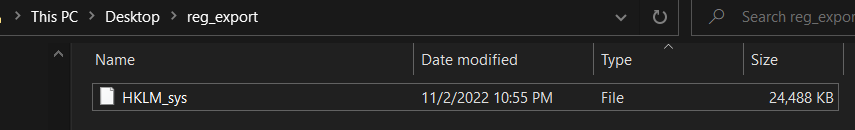
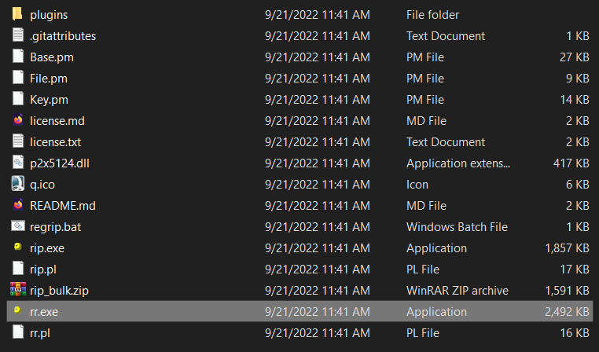
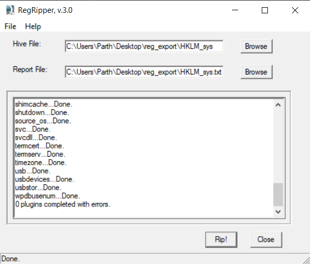
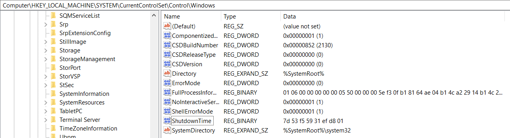
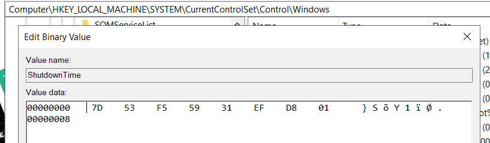
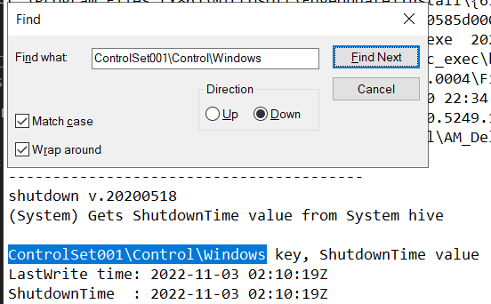

# Windows Data Conversion Assignment
**Parsing Method**: Manual using `Command Prompt`[^1]

## Parsing the Hives
Firstly I generated the output folder which is located on the desktop. 
```txt
C:\Users\Parth\Desktop>mkdir .\reg_export
```

```txt
C:\Users\Parth\Desktop\reg_export>reg save hklm\system HKLM_sys
The operation completed successfully.
```

I saved the following keys `hklm\software` to be parsed later. 

***Visual Output***:


## **Windows** RegRipper
RegRipper is an open source tool, written in Perl, for extracting/parsing information (keys, values, data) from the Registry and presenting it for analysis. It helps make the windows registry human readable. 

Clone Link: [Github](https://github.com/keydet89/RegRipper3.0)

## RegRipper Setup


Open up `rr.exe`
Lets start parse the `HKLM/System` hive. 



> This does take a bit of time. It has to run a lot of plugins. 

Notice in the log that it was able to detect the type of hive it was. This was a feature added in RegRipper 3.0. Before, you had to manually select the hive type. 
## Data Conversion

Looking at the last shutdown time we see on `regedit`:




**Recall** that we use RegRipper to parse the `HKLM/system` key.

We can open the `HKLM_sys.txt` to see what RegRipper parsed.

Use the find command to locate this value[^2].
 


[^1]: I could have done it using the GUI but I wanted to learn the command prompt since last time I did it using the GUI
[^2]: I could have also searched for `ShutdownTime`

