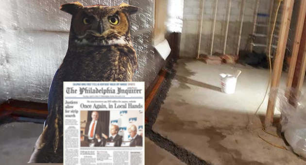

# Stego Owl
## Install
```bash session
sudo apt install steghide
```

## Image


## Process
### Embed
```bash
parth@parth-HP-Laptop-15-dy1xxx:~/Desktop/3605-stella$ touch secret.txt
parth@parth-HP-Laptop-15-dy1xxx:~/Desktop/3605-stella$ echo "My Secret Message: I kidnapped Stella the Owl" > ./secret.txt 
parth@parth-HP-Laptop-15-dy1xxx:~/Desktop/3605-stella$ cat secret.txt 
My Secret Message: I kidnapped Stella the Owl
parth@parth-HP-Laptop-15-dy1xxx:~/Desktop/3605-stella$ steghide embed --coverfile ProofofLife.jpg --embedfile secret.txt 
Enter passphrase: 
Re-Enter passphrase: 
embedding "secret.txt" in "ProofofLife.jpg"... done
```

> I used the extended syntax to show the actual process.

The passphrase is $3605$ .

### Extract
```bash
parth@parth-HP-Laptop-15-dy1xxx:~/Desktop/3605-stella$ steghide extract --stegofile ProofofLife.jpg -p 3605 -xf ext_secret.txt
wrote extracted data to "ext_secret.txt".
parth@parth-HP-Laptop-15-dy1xxx:~/Desktop/3605-stella$ cat ./ext_secret.txt 
My Secret Message: I kidnapped Stella the Owl
```

Used `-p` to specify the passphrase and used `-xf` to specify the output file path.  