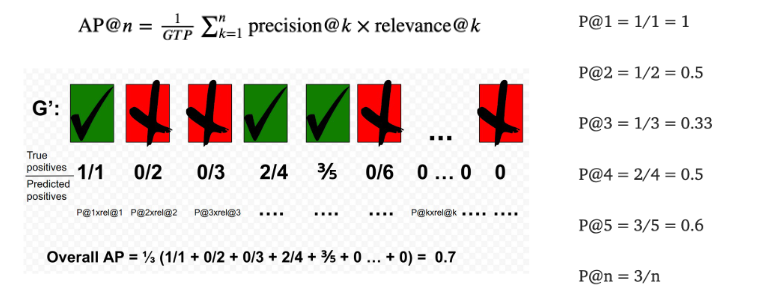

# Recommender System Cont

In [[Week 9.02 - 3 23 23 - Intro to Recommender System]], the last thing we looked at was Memory based CF: User-CF. 

> If we want to give recommendations to person $k$ about item $i,$ we have to find a number of *similar* peers who liked the same items as $k$ and have rated item $i$ and use that information to predict of $k$ will like $i$ .

However, the question of "How to measure user similarity?" remained.

## Similarity Score between Users
**Variables**:

+ $a, b$ - user
+ $r_a: \mathbb{R}^d$ - ratings given by user $a$
+ $r_{a, p}$ : rating of user $a$ of item $p$
+ $P$ set of items where both users $a$ and $b$ have rated the item

We can use cosine similarity to see how alike two users are:

$$
\text{sim}(a, b) 
= \frac{\hat{r_a}^T \cdot \hat{r_b}}{\|r_a\|\|r_b\|} 
= \frac{\sum_{p\in P} (r_{a, p}-\bar{r_a})(r_{b, p}-\bar{r_b})}{\sqrt{\sum_{p\in P} (r_{a, p}-\bar{r_a})^2}\sqrt{\sum_{p\in P} (r_{b, p}-\bar{r_b})^2}} \in [-1, 1]
$$

+ $\hat{r_a}, \hat{r_b}$ averaged adjusted rating vectors from respective users $a$ and $b$ (see comment block below)
+ $\bar{r_x}$ - average rating given by user $x$ 

> $\hat{\vec{x}} = \vec{x} - \bar{\vec{x}}$ where $\bar{\vec{x}}$ is the average value by component in ${\vec{x}}$

We can use this $\text{sim}(\dotso)$ to make predictions:

$$
\text{pred}(a, p) = \bar{r_a} + \frac{\sum_{b\in N}\text{sim}(a, b) * (r_{b, p} - \bar{r_b})}{\sum_{b\in N}\text{sim}(a, b)}
$$

> $N$ is the set of neighbors. 

We use $\bar{r}$ a lot since it helps remove bias from the ratings since some users may give overly high/low ratings. 

## Item Based - CF
We can use the same Cosine similarity to predict item ratings based in ratings of similar items.

$$
\text{pred}(u, p) = \frac
{\sum_{i\in{\text{rated\_item}(u)}} \text{sim}(i, p) * r_{u,i} }
{\sum_{i\in{\text{rated\_iteme}(u)}} \text{sim}(i, p)}
$$

+ $u$ - user you want to prediction for. 
+ $i$ other item rated by user $u$ 
+ $\text{sim}(i, p)$ - similarity between item $i$ and $p$ 
+ $r_{u,i}$ rating given to item $i$ from user $u$

## Evaluation and Metrics
1. MSE and RMSE

$$
\text{MSE} = \frac{1}{n} \sum_{i=1}^n | p_i - r_i |
$$

$p_i$ is the predicted rating while $r_i$ is the truth value. 

2. Precision and Recall
	+ Precision: fraction of all relevant items retrieved out of all items retrieved (tp+fp)
	+ Recall: determines the fraction of relevant items retrieved out of all relevant items (tp+fn)

3. Rankings
	+ Relevant items are more useful when they appear earlier in the recommendation list.

### Method 3: Rankings
#### Precision@K
Precision for the top $k$ items recommended:

#### Average Precision@k

$$
\text{AP@}n = \frac{1}{\text{GTP}} \sum_{k=1}^n \text{precision@k} \times \text{relevance@k}
$$

- $\text{GTP}$ - num total ground truth values
- $n$ total number of items you are interested in
+ $$\text{relevance@k} = 
\begin{cases}
1 & \text{if relevant} \\
0 & \text{else} \\
\end{cases}
$$

