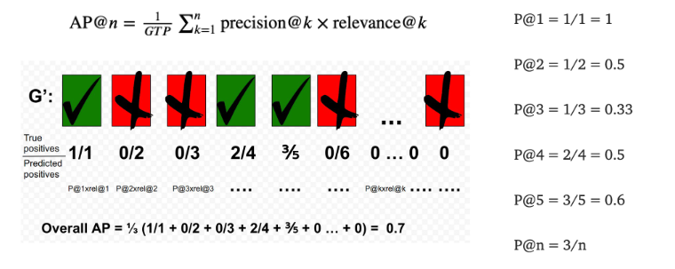
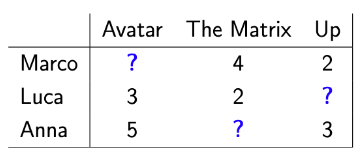

# Recommender System Cont

This will be a continuation of the discussion on evaluating Recommender Systems from [[Week 10.02 - 03 30 22 - Recommender System Cont]]. 

## Average Precision@k Cont. 

$$
\text{AP@}n = \frac{1}{\text{GTP}} \sum_{k=1}^n \text{precision@k} \times \text{relevance@k}
$$

- $\text{GTP}$ - num total ground truth values
- $n$ total number of items you are interested in
+ $$\text{relevance@k} = 
\begin{cases}
1 & \text{if relevant} \\
0 & \text{else} \\
\end{cases}
$$

### Example
Suppose we have two Recommender systems $r_1$, $r_1$ working with 6 items. 

> The GTP is 3 since the user only liked 3 items. 

| System | Rating for $I_1$ | Rating for $I_2$ | Rating for $I_3$ | Rating for $I_4$ | Rating for $I_5$ | Rating for $I_6$ |
| ------ | ---------------- | ---------------- | ---------------- | ---------------- | ---------------- | ---------------- |
| $r_1$  | ✅               | ❌               | ❌               | ✅               | ✅               | ❌               |
| $r_2$  | ✅               | ✅               | ❌               | ✅               | ❌               | ❌               |

From the image above we can see that $r_1$ has a AP of $0.7$

Finding AP for $r_2$ :

$$
\frac{1}{3} \biggr[ 1/1 + 2/2 + 0\cdot\frac{2}{3} + 3/4 + 0\cdot\frac{3}{5} + 0\cdot\frac{3}{6} \biggr] = \boxed{\frac{11}{12}}
$$

Notice this solves the issue precision@k had.[^1]

## Cumulative Gains
### Cumulative Gain
It is the sum of the relevance of recommendations, **but** it does not consider rank. 

$$
CG_\text{pos} = \sum^{\text{pos}}_{i=1} \text{relevance}_i
$$

If we ran $CG_6$ on both $r_1$ and $r_2$ both would yield 3.

### Discounted Cumulative Gain

$$
DCG_\text{pos} = \text{rel}_1 + \sum^{\text{pos}}_{i=2} \frac{\text{rel}_i}{\log_2 i}
$$

Applies a logarithmic reduction factor to give a penalty for highly relevant item appearing lower than it should be. 

### Idealized Discounted Cumulative Gain

$h$ is the number of positive items. IDCG calculates the best possible DCG.

$$
IDCG_\text{pos} = \text{rel}_1 + \sum^{|h|}_{i=2} \frac{\text{rel}_i}{\log_2 i}
$$

<!--Should h be h-1 ?? -->

### Normalized Discounted Cumulative Gain

$$
NDCG_\text{pos} = \frac{DCG_\text{pos}}{IDCG_\text{pos}}
$$

## Singular Value Decomposition - SVD

Sure, Singular Value Decomposition (SVD) is a commonly used technique in Recommender Systems for identifying hidden patterns in user-item interaction data.

It takes a user-item matrix $X$ and creates three matrices out of them:
1. $U$ - User features
2. $S$ - strength of each feature
3. $V$ - Item features

The resulting matrices can then be used to make predictions for new items that a user has not yet interacted with.

Sample User-Item matrix $X$ :

In this class, missing values can be filled with Zero or Mean Imputation.[^2]  

The rows of $U$ represents the users while the columns represent the  latent features[^3] for each user. This also applies to $V$ but with items except the rows represent the latent features. 

[^1]: precision@k did not consider ranking order yet AP@k does. 
[^2]: Mean Imputation is when the missing values for a user are filled with a mean of their given (existing) ratings. 
[^3]: Latent features, also known as hidden features, are underlying attributes or characteristics that are not directly observable in the data but are inferred from patterns in the data.