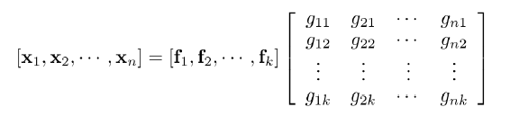

# Document Analysis

Much like the algorithms before, the goal of Document Analysis is to learn a mapping function

$$
x_i \stackrel{f(x)}{\longrightarrow} y_i
$$

given $n$ samples $\{(x_i, y_i)\}_{i=0}^n$ where $x_i$ is a **document**.

**Applications**:
1. Email (Spam Detection)
2. Review Classification
3. Article (Topic Clustering)

## Representing Text as a Vector
We can convert the words to numbers via
1. Label/Ordinal Encoding
2. One Hot Encoding (OHE)

### Bag of Words Method

Each word gets an index and in that index is the number of times that word in seen. 

**Issues**
+ Cannot preserve ordering
+ High Dim and sparse
+ Some words are too common (*the*, *it*, *a*, ...)

### Term Frequency and Inverse Document Frequency

This method assigns an importance rating to a word. 

$$
\text{TF\_IDF} = \text{TF}(t, d) \cdot \text{IDF}(t)
$$

Words with a higher score are more important

#### Term Frequency

$$
\text{TF}(t, d) = \frac{\#t \text{ in document } d}{\#\text{words} \text{ in document } d}
$$

#### Inverse Document Frequency

$$
\text{IDF}(t) = \log\frac{\# \text{documents}} {\#\text{documents} \text{ containing } t}
$$

## Document Clustering (Ex: Topic Discovery)

Methods: Kmeans, Spectral Clustering, Agglomerative Clustering, ...

$$
X \approx FG^T
$$

+ $X$ - Data Matrix
+ $F$ - Matrix of the basis vectors
+ $G$ - Weights assigned to the basis vector 

Notice that in terms of $X = [x_1, \dotso, x_n]$

$$
x_i = f_1g_{i1} + \dotso + f_kg_{ik}
$$

What this says is that each sample vector $x_i$ is built using a combination of the basis vectors. 

Since the basis vectors define an alternate coordinate system they represent *topics*. By knowing what basis are used to create a sample of $X$ , one can determine which topic a $\vec{x}_i$ belongs to. The matrix $G$ is responsible for showing this information. 

For example, the first row of $G$ will display which basis vectors were used to create $\vec{x}_1$ which can help assign that sample to a topic. 

$$\underbrace{\min\|X-FG^T\|_F^2}_{\text{Loss Function}}$$

where $F, G \geq \mathbf{0}$

In practice, a gradient decent method is used to discover $F, G$ .