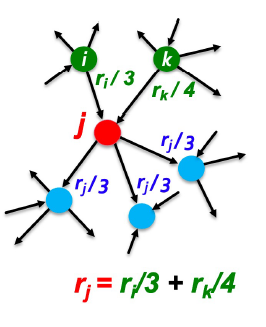
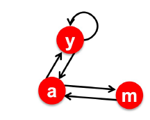

# Page Rank
## Background: Graphs

When a *directed* Graph is stored as a adjacency matrix,
+ Indegree = column sum
+ Outdegree = row sum

Why? An entry in a matrix $a_{ij}$ says that $i$ is connected to $j$. If we iterate down the rows (column sum) you will see how many in connections $j$ has. 

## Page Ranking

In the graph of the internet:
+ Nodes: Websites / Webpages
+ Edges: Hyperlinks

The page rank algorithm needs to assign each page some "importance". We can use the links as "votes" for a website and use the number of in/out degrees to calculate the value of the vote. 

### Page Voting

> A vote from an important page is worth more.

If a page $i$ of importance $r_i$ has $d$ out links, each link gets $r_i / d_i$ vote. 

A page $j$ has its importance calculated by the sum of its invotes. 

This is formally written as:

$$
r_j = \sum_{i \to j} \frac{r_i}{d_i}
$$

Where $d_i$ is the number of out degrees from page $i$ .

### Matrix Formation

Consider this graph:

It seems that

$$
\begin{align}
r_y &= r_y / 2 + r_a / 2 \\
r_a &= r_y / 2 + r_m / 2 \\
r_m &= r_a / 2
\end{align}
$$

We can build a transition matrix from the above data:

$$
\begin{bmatrix}
1/2 & 1/2 & 0\\
1/2 & 0 & 1 \\
0 & 1/2 & 0
\end{bmatrix}
$$

This can be viewed as a Markov process where the value $M_{ij}$ represents the probability of a person at page $i$ to travel to page $j$ . 

Evidently this can be used in a random walk experiment to determine a stationary distribution[^1]. This is when the process below stabilizes:

$$
p(t+1) = M \cdot p(t)
$$

The initial conditions would be $\vec{r}^0 = [1/N, \dotso, 1/N]$ and we keep applying the matrix $M$ to $r^k$ to determine the chances of any user being at any page after $k$ steps. 

[^1]: This is when the difference between $r^{k+1}$ and $r^k$ becomes very small: $\epsilon$