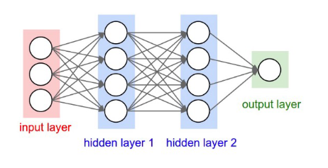
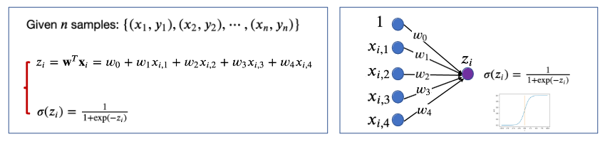
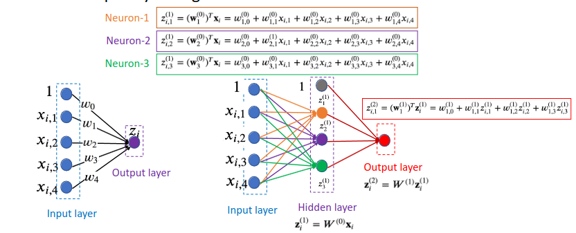

# Fully-connected Neural Network
> Multi-layer perceptron (MLP)

Recall [[Week 5.01 - 02 14 23 - Logistic Regression]]. Given $n$ samples, we find a vector $\vec{w}$ that optimizes[^1] the binary decision.

The $1$ and $w_0$ represent a bias term.[^2] The image above a **1 Layer** MLP. 

## Multiple Layers

Consider a $L$ layer network.

To transition from input layer to $1$ :

$$
z_i^{(1)} = W^{(0)}x_i
$$

At layer $L$ the process is:

$$
z_i^{(L)} = W^{(L-1)}z_i^{(L-1)}
$$

If we unravel this we notice that this method is still **LINEAR**:

$$
\underbrace{z_{i}^{(L)}}_{\text{used for final pred}} = 
W^{(L-1)}\cdots W^{(1)}W^{(0)}x_i
$$

## Hyperparameters 
We can think about the size of each hidden layer and the number of layers as hyper parameters.

Suppose a sample $x_i \in \mathbb{R}^{d_0}$ . The matrix $W^{(0)}$ will convert it to a vector $z_i^(1) \in \mathbb{R}^{d_1}$ where $W^{(0)} \in \mathbb{R}^{d_1 \times d_0}$ .

$$
\begin{align}
W^{(0)} &\in \mathbb{R}^{d_1 \times d_0} \\
W^{(1)} &\in \mathbb{R}^{d_2 \times d_1} \\
W^{(2)} &\in \mathbb{R}^{d_3 \times d_2} \\
\cdots \\
W^{(L-1)} &\in \mathbb{R}^{d_L \times d_{L-1}} \\
\end{align}
$$

## Linear To Non-Linear Model

> Add a non-linear activation function to each *hidden* layer. This is because neural nets can approximate any function well.

### Example: Sigmoid Function

$$
\sigma(x) = \frac{1}{1+e^{-x}}
$$

At the input we have the following transformation:

$$
z_i^{(1)} = W^{(0)}x_i,\ h_i^{(1)} = \sigma(z_i^{(1)})
$$

We compute the $h_i^{(1)}$ which is the function $\sigma(x)$ applied to each component in the output vector. 

In the next step we do the same thing.

$$
z_i^{(2)} = W^{(1)}h_i^{(1)},\ h_i^{(2)} = \sigma(z_i^{(2)})
$$

In the last layer $L$ we would need to compute:

$$
z_i^{(L)} = W^{(L-1)}h_i^{(L-1)},\ h_i^{(L)} = \sigma(z_i^{(L)})
$$

### Some other Activation Functions
#### `tanh`

$$
\tanh(x) = \frac{2}{1+e^{\left(-2x\right)}}-1
$$

#### `ReLu`

$$
\text{ReLu}(x) = \max(0, x)
$$

[^1]: Makes the model most accurate
[^2]: A bias term is required as it allows us to shift the predicted probability up or down as needed to better fit the training date. 