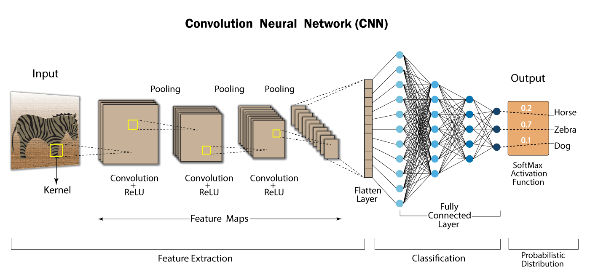
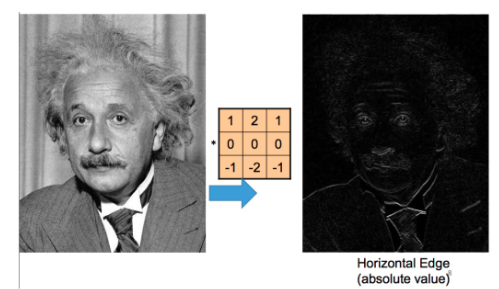
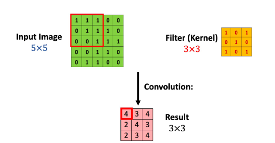
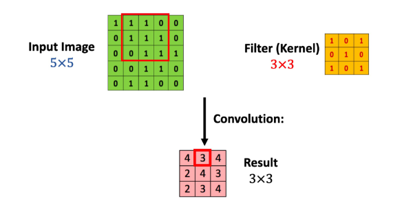
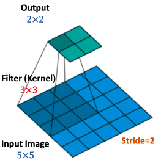

# Convolutional Neural Network

Consider a FCNN[^1] that takes a $1000 \times 1000$ image as input. If we have 1 million internal neurons notice this is $10^{12}$ parameters since each of the $1000 \times 1000$ input nodes will be taken into account when interacting with the internal nodes.[^2]

This is not the case with a CNN[^3], each node is not connected to the next layer. 

The output of one convolutional layer serves as the input to the next convolutional layer. However, in CNNs, each node in a layer is typically only connected to a subset of the nodes in the next layer. This is achieved through a technique called pooling, it makes CNNs **more powerful** because they are able to utilize locality.[^4]

## Mathematical Operation: Convolution 

> Matrix Inner Product: Sum of element wise product

$$
\langle A, B \rangle = \sum_i \sum_j a_{ij} b_{ij}
$$

This is the same result as $\langle A, B \rangle = \langle \text{vec}(A), \text{vec}(B) \rangle$

## Image Operation: Convolution
Certain matrices can be used as a *filter* to help extract filters from images. 

An example is the Horizontal Sobel Filter[^5]:

$$
\begin{bmatrix}
1 & 2 & 1 \\
0 & 0 & 0 \\
-1&-2 &-1
\end{bmatrix}
$$

**Usage**

---

## Convolution Operations

To analize hidden features we need to apply a filter to an image. 

The filter is swept across the image as shown below. 

Notice the Convolution between the filter and the red bordered matrix is $4$ .

The next step was:

We can predict the output matrix:

$$
\begin{align}
\text{input} &= d_1 \times d_2 \\
\text{filter} &= k_1 \times k_2 \\
\\ 
\text{output} &= (d_1 - k_1 + 1) \times (d_2 - k_2 + 1) \\
\end{align}
$$

### Using Padding

if we want to keep the next layers width and height the same as the current layer we can add a zero padding.

Say our filter was a 3 by 3 and we pad with 1 layer of zeros: 

$$
\underbrace{X}_{\text{input image}} \to 
\begin{bmatrix}
0 & \cdots & 0 \\
\vdots & X & \vdots \\
0 & \cdots & 0
\end{bmatrix}
$$

This changes the dimensions of the input:

$$
\text{input} = d_1 \times d_2 \to (d_1+2) \times (d_2+2) \\
$$

With the padding, the output will be:

$$
\text{output} = d_1 \times d_2
$$

### Stride
The filter moves $K$ step each time, $K \geq 1$ .

When connecting information instead of moving for example 1 cell to the left the movement would be 2 cells in this case. 

$$
\begin{align}
\text{input} &= d_1 \times d_2 \\
\text{filter} &= k_1 \times k_2 \\
\text{stride} &= s
\\
\text{output} &= \biggr(\biggr\lfloor \frac{d_1 - k_1}{s} \biggr\rfloor + 1\biggr) \times \biggr(\biggr\lfloor \frac{d_2 - k_2}{s} \biggr\rfloor + 1\biggr) \\
\end{align}
$$

[^1]: Fully-connected Neural Network
[^2]: Notice that between layers, each node's value is take into account when obtaining the parameters for the next layer.
[^3]: Convolutional Neural Network
[^4]: Notice other methods we have learned take the image as a one column vector implying local behavior of an image is lost. 
[^5]: The word *Horizontal* implies there is the vertical version (just its transpose) to help detect vertical edges. 