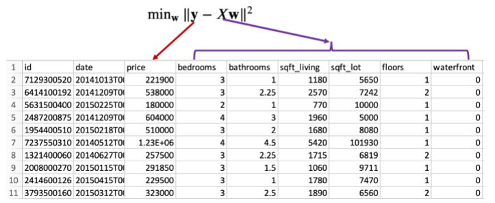

# Intro to Vectors and Matrices

> Most details are omitted since I have learned this material in other classes.

## Terminology 
+ Feature vector: vector of features
	+ Notation used: $S_i = [f_1, \dotso, f_k]$
+ Feature Matrix:
	+ Notation Used: ( $S_k$ are feature vectors )

$$
\begin{bmatrix}
S_1\\
S_2\\
\vdots\\
S_n
\end{bmatrix}
$$

## Linear Regression

$$
\min_{\vec{w}} \frac{1}{n} \|\vec{y}-X\vec{w}\|_2
$$

+ $\vec{y}$ - Ground Truth (correct resultant values pulled from training data)
+ $X$ - feature matrix
+ $\vec{w}$

**Example from Class**

**Explanation of the formula**: 

The vector norm is $\ell_2$ since it attempts to minimize the least squares distance. The resulting $\vec{w}$ that does so can be thought of as the weight per feature. 

I have more detailed notes about this topic in Numerical Analysis I notes. 

## Norms

Consider $\vec{x} \in \mathbb{R}^n$

$$
\begin{align}
\ell_1 &: \|x\|_1 = \sum |x_i| \\
\ell_2 &: \|x\|_2 = \sqrt{\sum x_i^2} \\
\ell_\infty &: \|x\|_\infty = \max_{1\leq i \leq n} |x_i| \\
\end{align}
$$

> Vector Distance: $\|x-y\|_2$

**Properties of all Norms**:

1. $\|x\|\geq0$
2. $\|x\| = 0 \iff x = \vec{0}$
3. $\|\alpha \vec{x}\| = |\alpha|\|x\|$
4. $\|x+y\|\leq\|x\|+\|y\|$ (Triangle inequality)
