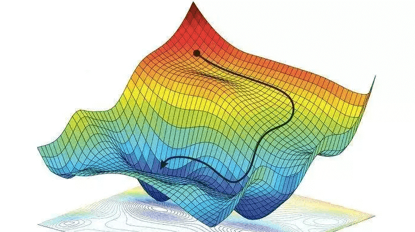
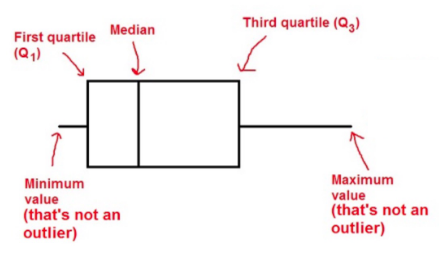
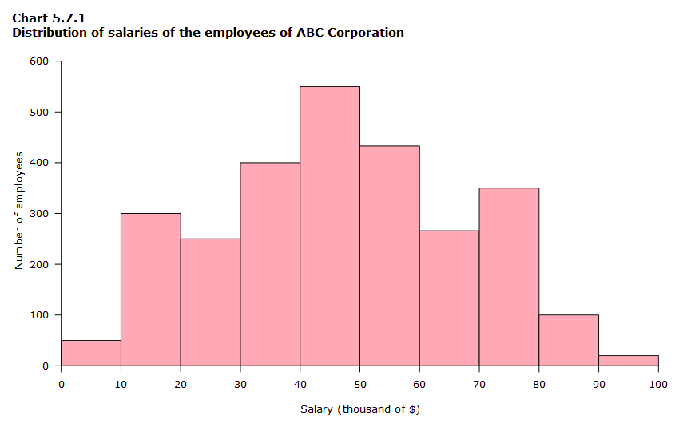

# Week 2 - 01 26 23
## Frobius Norm

$$
\text{For } A \in \mathbb{R}^{n \times n}, \ \|A\|_F = \sqrt{\sum_{i=0}^n \sum_{j=0}^n a_{ij}^2}
$$

**Matrix Norm Properties**:
1. $\|A\| \geq 0$
2. $\|A\| = 0 \iff A = \mathbf{0}$
3. $\|\alpha A\| = |\alpha|\|A\|$
4. $\|A\| + \|B\| \geq \|A + B\|$

> Matrix norms have the same properties as vector norms

## Orthonormal Basis

Let $X = [\vec{x}_1, \dotso, \vec{x}_n]$

A matrix is said to have a orthonormal basis if:

$$
\forall (\vec{x}_i,\vec{x}_j),\ x_i^T x_j = 0 \text{ and } \|x_i\|_2 = 1
$$

Notice that for an Orthonormal matrix:

$$
X^TX = I
$$

## Gradient Decent

- Decreasing the loss function **towards the direction of the negative gradient**

$$
x_{t+1} = x_t - \eta \nabla f(x_t)
$$

$x_0$ would be *your* initial guess. It can be $\vec{0}$ .

In the case of the linear regression model 

$$
\min_{\vec{w}} \|\vec{y} - X\vec{w}\|_2
$$

Gradient Decent can be use iteratively using a threshold: $\|x_{t+1} - x_t\| \lt \epsilon$

> The $\eta$ is the 'step size' or learning factor. A large $\eta$ will make the model take bigger jumps. 

## Exploratory Data Analysis

Once a dataset is load, the first step is to look at it:
+ If it is small inspect it directly
+ If not, use visualization or some statistic.

### Tabular Data

> The dataset is a table (2d array).

This type of data can have `Numerical` or  `Categorical` features. 

+ You can always use statistics to look at numerical data.
	+ Look at `df.describe` (`df` is a `pandas.core.frame.DataFrame`
	+ Look at generating box plots. (see Figure 1)
	+ Look at generating Histograms. (see Figure 2) 
		+ Histograms display the frequency of values via small intervals ranging from min to max. 

**Graphic: Figure 1**

**Graphic: Figure 2**

Along with box plots and histograms, scatter plots can also be very useful.