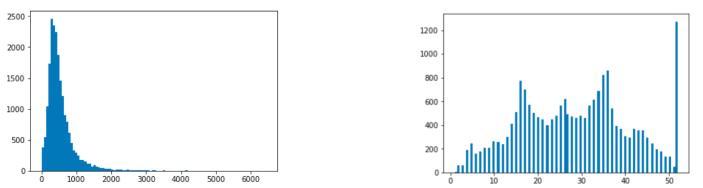

# Data Preprocessing
## Preface

> Long Tail Distribution (Left) vs Non-Long Tail Distribution (Right)

## Why is Data Preprocessing required?
1. Missing Values
	+ A model will not be as performant of a lot of training feature vectors are missing a values
2. Categorical features
	+ If a feature uses strings how will it be treated during numerical calculations?
		+ Example: `KNN` Distance Calculations
3. Different scales
	+ When numerical features are vastly different in value
		+ Ex: `[1, 4, 5, 679438]` 

## Preprocessing
### Missing Values
Missing values are detected via `df.isnull()`.

Treating them varies on the type of distribution and the amount of missing values.

If $\gt 50\%$ of the feature values are missing, *dropping* the feature might be valuable. 

Otherwise filling in values might be the next best option. The value for filling in data depends on the type of distribution. 
+ Long Tail distribution: `Median`
+ Non-Long Tail Distribution: `Mean` 

> This answers the question for *Numerical* Features but what about **Categorical**?

Since it is not possible to compute the `mean` or `median`, you can fill in with a static value. 

### Preprocessing Categorical Features
Since mathematical operations are not defined on Categorical features, they need to be converted to *numerical features* via some encoding. It can be as simple as mapping a categorical feature to an integer value. 