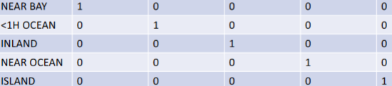
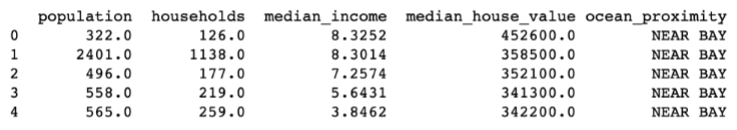

# Data Preprocessing Cont

## Preprocessing Categorical Features
Since mathematical operations are not defined on Categorical features, they need to be converted to *numerical features* via some encoding. It can be as simple as mapping a categorical feature to an integer value. 

From: [[Week 3.02 - 01 31 23 - Data Preprocessing]]

### Label Encoding
If a feature $x_i$ can retain the following values:

```txt
<1H OCEAN, INLAND, NEAR OCEAN, NEAR BAY, ISLAND
```

We can give each categorical value a numerical value. 

```txt
<1H OCEAN     1
INLAND        2
NEAR OCEAN    3
NEAR BAY      4
ISLAND        5
```

### One-Hot Encoding
Consider a feature vector $\vec{v}$ with $n$ features with the last feature being a categorical feature with $k$ different values. 

Initially, $\vec{v} = \langle x_1,\ \dotso\ , \mathbf{x_n}  \rangle$

However, with One-Hot Encoding, $x_n$ gets turned into a binary vector where it has a single $1$ that corresponds to that value being present. 



$\vec{v}$ is extended to be:

$$
\langle x_1,\ \dotso\ , \underbrace{x_n^1\ ,\ \dotso\ , x_n^k}_{\text{One-Hot Encoding}} \rangle
$$

> One-hot Encoding increases the number of features (i.e $\dim(\vec{v})$  ) and therefore allows the model to recognize more complex relationships.

### Ordinal Encoding
+ Ordinal Encoding is used when the order of the categorical feature is relevant. 

Example:

| Categorical Feature Value | Integer Correspondence |
| ------------------------- | ---------------------- |
| Poor                      | 1                      | 
| Good                      | 2                      |
| Very Good                 | 3                      |
| Excellent                 | 4                      |

### Feature Scaling

Consider this feature matrix:



Notice that each feature has a different scale. This **will** throw off the ML model. 

#### $\min-\max$ Normalization

$$
x' = \frac{x-x_\min}{x_\max - x_\min}
$$

This transformation $\mathbb{R}\to[0, 1]$ would occur to each feature (column). 

Consider the `median_house_value` column. 

$$
\begin{align}
\max &= 452600 \\
\min &= 341300 \\ \\
\begin{bmatrix}
452600 \\
358500 \\
352100 \\
341300 \\
342200
\end{bmatrix}
\to 
&\frac{x-x_\min}{x_\max - x_\min} 
\to
\begin{bmatrix}
1 \\
0.155 \\
0.097 \\
0 \\
0.008
\end{bmatrix}
\end{align}
$$

#### Z-Score normalization (Standardization)

$$
\begin{align}
x' &= \frac{x - \bar{x}}{\mathbf{\sigma}} \\ \\ \\
\bar{x} &= \text{mean} \\
\sigma^2 &= \frac{1}{n}\sum_{i=1}^n (x_i - \bar{x})^2
\end{align}
$$

> This method can produce negative feature values