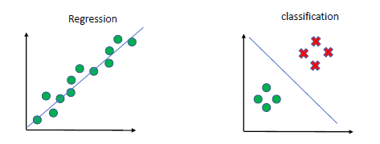
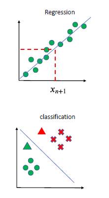
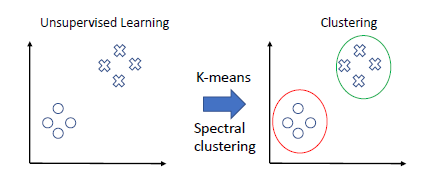
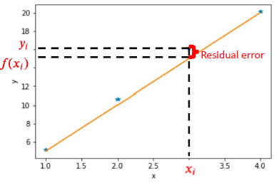

# Linear Regression Lecture

<!-- car did not want to get defrosted this morning (2/7/23) -->

## Preface about Learning Methods
> Supervised learning is a machine learning paradigm for problems where the available data consists of labeled examples, meaning that each data point contains features and an associated label.

Linear regression is a supervised learning algorithm. The entries are labeled and the goal is to predict labels for new entries. The goal of a Supervised method is to *learn* a mapping function from $x_i \stackrel{f(x)}{\to} y_i$ given some samples $\{x_i, y_i\}_{i=1}^{n}$ .

If $y$ is continuous, it is a regression problem where as if $Y$ is a discrete variable, it will become a classification problem. 

Here is what it looks like when we are given a new sample $x_{n+1}$ :

---

**Un**supervised learning is where data is **not** labeled and the goal is to find hidden patterns behind the data via clustering. 

**Unsupervised Learning Graphic:**

---

## Linear Regression

Recall the goal of learning some mapping function for linear regression:

$$x_i \stackrel{f(x)}{\longrightarrow} y_i$$

Well, $f(x)$ is a linear combination of $d$ input features:

$$
f(x_i) = \overbrace{w_0}^{\text{bias}} + w_1x_{i, 1} +\ \dotso\ + w_dx_{i, d} = \underbrace{\vec{w}^Tx_i}_{\text{dot product}}
$$

> If the bias is **not included** the regression line will always pass the origin. 
 
The $x_i$ is the feature vector for the $i$ -th sample where as $\vec{w} = \langle w_0,\ \dotso\ , w_d \rangle$ is the model parameter. 

Consider this Dataset:

| $x$ | $y$   |
| --- | ----- |
| 1   | 5.14  |
| 2   | 10.67 |
| 3   | 16.17 |
| 4   | 20.12 | 

We want a vector $\vec{w} = \langle w_0, w_1 \rangle$ such that 

$$
\begin{align}
f(x_1) &= w_0 + w_1 * 1 \\
f(x_2) &= w_0 + w_1 * 2 \\
f(x_3) &= w_0 + w_1 * 3 \\
f(x_4) &= w_0 + w_1 * 4
\end{align}
$$

There may be many $\vec{w}$ that get close.

## Optimizing The Model
Error is determined at each sample using:

$$
y_i - f(x_i)
$$

We wish to minimize this error:

$$
\underbrace{\min_{\vec{w}} \frac{1}{n}\sum_{i=1}^{n}\ \biggr[\ y_i - f(x_i)\ \biggr]^2}_{\text{Loss Function}}
$$

**Graphic of Residual Error**:

### Vector Representation

$$
\vec{y} = 
\begin{pmatrix}
y_1 \\
y_2 \\
\vdots \\
y_n
\end{pmatrix},\ \ \ \
f(\mathbf{X}) = \mathbf{X}\vec{w} = 
\begin{bmatrix}
1 & x_{11} & \dotso & x_{1d} \\
1 & x_{21} & \dotso & x_{2d} \\
\vdots & \vdots & \ddots & \vdots \\
1 & x_{n1} & \dotso & x_{nd}
\end{bmatrix}
\begin{pmatrix}
w_1 \\
w_2 \\
\vdots \\
w_d
\end{pmatrix}, \ \ \ \ f(\mathbf{X}) \in \mathbb{R}^{d\times1}
$$

For the general case ( $\vec{y}\in\mathbb{R}^{n\times 1}$  ), we would like to minimize:

$$
\min_{\vec{w}} \frac{1}{n} \|\ \vec{y} - \mathbf{X}\vec{w}\ \|_2^2
$$

> The " $\| \|_2$  " stands for the vector norm $\ell_2$

### Optimizing The Model - Loss Function

$$
\mathcal{L}(\vec{w}) = \|\ \vec{y} - \mathbf{X}\vec{w}\ \|_2^2
$$

The optimal $\vec{w}$ is:

$$
\vec{w} = (\mathbf{X}^T\mathbf{X})^{-1}\mathbf{X}^T\vec{y}
$$

## Evaluation

> $\vec{e_i} = \vec{y_i} - f(\vec{x_i})$  (residual error see graphic above)

### MAE - Mean Absolute Error

$$
\frac{1}{n} \sum_{i=1}^n |e_i|
$$

### MSE - Mean Squared Error

$$
E = \frac{1}{n} \sum_{i=1}^n e_i^2
$$

### RMSE - Root Mean Square Error

$$
\sqrt{E} = \sqrt{\frac{1}{n} \sum_{i=1}^n e_i^2}
$$

## Misc

A linear model can be overfitted if too high of a weight is given to unimportant variables:

$$
f(\vec{x}) = w_0 + w_1x_1 + w_2x_2 + \dotso + w_nx_n
$$

### Example
**Data**:

| $x$ | $y$   |
| --- | ----- |
| 1   | 5.14  |
| 2   | 10.67 |
| 3   | 16.17 |
| 4   | 20.12 |

Then:

$$
\overbrace{
\begin{bmatrix}
1   & 1  \\
1   & 2 \\
1   & 3 \\
1   & 4
\end{bmatrix}
}^{X}
\vec{w}
=
\underbrace{
\begin{pmatrix}
5.14  \\
10.67 \\
16.17 \\
20.12 
\end{pmatrix}
}_{\vec{y}}
$$

We would like a $\vec{w}$ such that $X\vec{w}$ gets us as close to $y$ (ground) truth as possible. The next lecture [[Week 4.02 - 02 07 23 - Extending Linear Regression and Using Regression]] will speak more on this. 