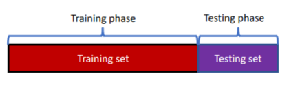
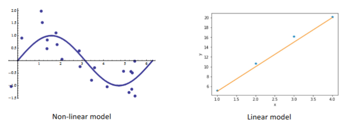
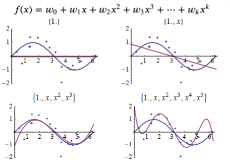
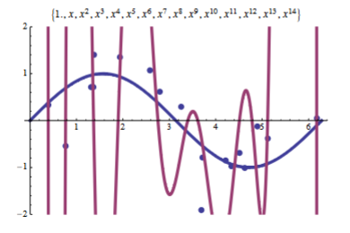

# Extending Linear Regression and Using Regression
## Finding Model Parameter $\vec{w}$

Recall that the optimal $\vec{w}$ was:

$$
\vec{w} = (\mathbf{X}^T\mathbf{X})^{-1}\mathbf{X}^T\vec{y}
$$

However, $(\mathbf{X}^T\mathbf{X})^{-1}$  is too expensive for large $\mathbf{X}$ , therefore Gradient Descent is used. 

> Note: The function $f(\vec{x})$ used in Gradient Descent is $\|\vec{y} - \mathbf{X}\vec{w}\|$

## Using Regression
Steps:

1. Preprocessing Data (See [[Week 3.02 - 01 31 23 - Data Preprocessing]], [[Week 3.03 - 02 02 23 - Data Preprocessing]])
2. Split Dataset in to a test set (to learn the mapping function) and a test set. 

3. Train the model 
4. Evaluate the model
	+ Evaluation Methods:
		+ 	Mean Absolute Error (MAE)
		+ 	Mean Squared Error (MSE)
		+ 	Root MSE

## Non-Linear Fitting

Example of Non Linear Data:

### Applying Transformations
#### One Dimensional

Take a single dimensional vector:

$$
x \stackrel{\phi(x)}{\longrightarrow} \{1, x, x^2, \dotso, x^k\} \implies f(x) = w_0 + \sum_{i=1}^k w_kx^k
$$

**Example**:

*Linear Model*:

| $x$ | $y$   |
| --- | ----- |
| 1   | 5.14  |
| 2   | 10.67 |
| 3   | 16.17 |

**Non Linear Model**:

| $x$ | $x^2$ | $x^3$ | $x^4$ | $y$   |
| --- | ----- | ----- | ----- | ----- |
| $1$ | $1^2$ | $1^3$ | $1^4$ | 5.14  |
| $2$ | $2^2$ | $2^3$ | $2^4$ | 10.67 |
| $3$ | $3^2$ | $3^3$ | $3^4$ | 16.17 |

#### Two Dimensional 
$$
x = (x_1, x_2) \stackrel{\phi(x)}{\longrightarrow} \{1, x_1, x_1^2, x_2, x_2^2, x_1x_2 \} 
$$

> $x_1x_2$ represents the correlation between the two variables. 

### Fitting Non Linear Data

#### Overfitting

Overfitting is when the error on the dataset is small but the error on new points will be large. This stems from the erratic nature of polynomials when connecting points (interpolation).

To **avoid** overfitting, add a regularization term[^1].

$$
f(\vec{w}) = \underbrace{\frac{1}{n}\|\vec{y} - \mathbf{X}\vec{w}\|}_{\text{Fit the data}} + \overbrace{\lambda\|\vec{w}\|_2^2}^{\text{Control the Model's Complexity}}
$$

$\lambda$ - hyperparameter[^2]

$$
\lambda = 
\begin{cases}
\lt 0 & & \text{not a valid value} \\
0 & \text{then} & \text{no regularization} \\
\text{large } \lambda & \text{then} & \text{very small }\vec{w}
\end{cases}
$$

Minimizing the magnitude of $\vec{w}$ (directly or gradient descent) allows it to be as small as possible with the chance of some $w_i$ being $0$ . 

## Ridge Regression vs Lasso

> Recall: $\ell_1 = \sum |a_i|$

+ Ridge: the second term above uses $\ell_2$ (i.e $\lambda\|\vec{w}\|_2^2$  )
+ Lasso: the second term above uses $\ell_1$ (i.e $\lambda\|\vec{w}\|_1$ ) 
	+ More likely to generate sparse vectors. 

[^1]: Regularization refers to techniques that are used to calibrate machine learning models in order to minimize the adjusted loss function and prevent overfitting or underfitting.
[^2]:A hyperparameter is a parameter whose value is used to control the learning process