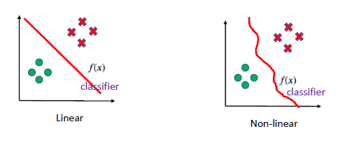
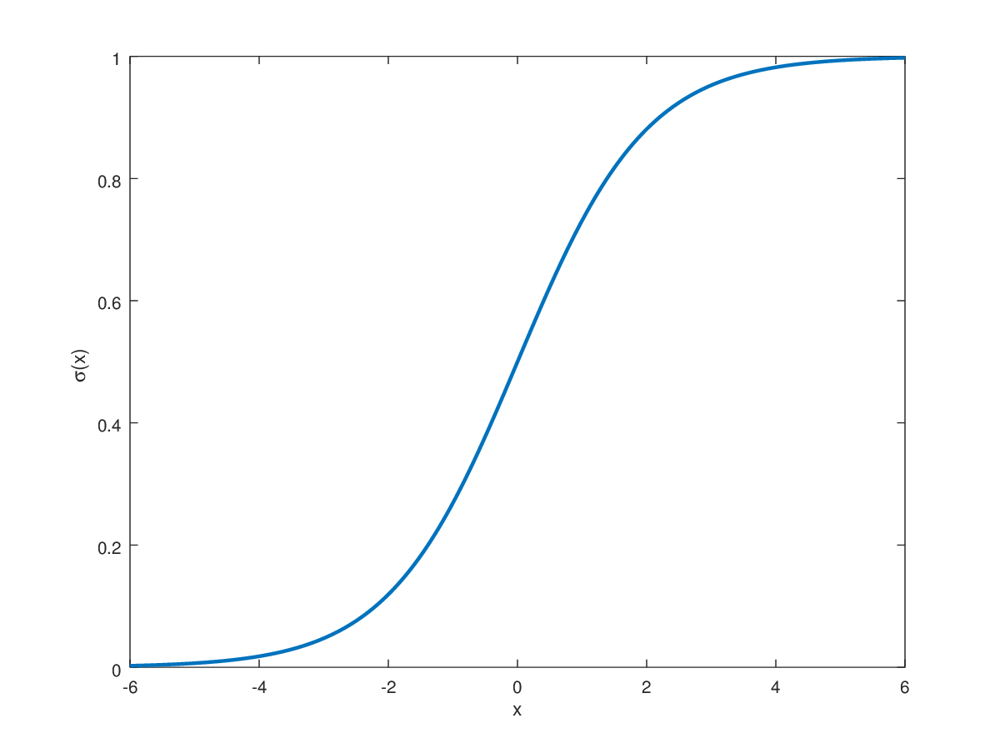

# Logistic Regression
## Classification
### Binary Classification
+ Only two classes
	+ Ex: Fraud Detection

Given $n$ samples, learning a mapping function to separate positive samples form negatives.

$$
\overbrace{
\{(x_i, y_i)\}_{i=1}^n}^{n\text{ samples}} 
\to f(x_i) = 
\begin{cases}
0 & \text{negative sample} \\ 
1 & \text{positive sample}
\end{cases}
$$

#### Types of Classifiers

##### Linear Classifier

$$
z(\vec{x}) 
= \vec{w}^T\vec{x}
= w_o + w_1x_1 + \dotso + w_dn_d
$$

$z(\vec{x})$ specifies a **linear boundary** which separates the space into two spaces.

$$
\text{Decision rule: }\ \hat{y} =
\begin{cases}
1 & z(\vec{x}) \gt 0\\ 
0 & z(\vec{x}) \lt 0
\end{cases}
$$

##### Logistic Regression
> solves the problem of letting the classifier 0 or 1 based on sample

$$
\sigma(z) = \frac{1}{1+\exp(-z)} = 
\begin{cases}
z \gt 0 & {\sigma(z) \approx 1 \implies \text{label }=1}\\
z \lt
 0 & {\sigma(z) \approx 0 \implies \text{label }=0}\\
z = 0 & {\sigma(z)=0.5} 
\end{cases}
$$

So what we want here is a $\vec{w}$ such that 

$$
f(x_i) = \frac{1}{1+\exp(-\vec{w}^Tx_i)} = 
\begin{cases}
0 & {\text{negative samples}} \\
1 & {\text{positive samples}}
\end{cases}
$$

###### Probabilistic Interpretation
The probability that a sample belongs to class $1$ given a vector $\vec{x}$ .

$$
\begin{align}
p(y = 1|\vec{x}) = \sigma(\vec{w}^T\vec{x})
&= \frac{1}{1+\exp(-\vec{w}^Tx_i)}\ \ \text{mult num/demon by }\exp{\vec{w}^T\vec{w}} \\ \\
&= \frac{\exp(\vec{w}^Tx_i)}{1+\exp(\vec{w}^Tx_i)}
\end{align}
$$

Consequently:

$$
p(y = 0|\vec{x}) = 1 - p(y = 1|\vec{x}) = \frac{1}{1+\exp(\vec{w}^Tx_i)} 
$$

###### How to optimize **?!**
**Likelihood Function:** Measure how well a model fits the data. 

$$
L(\theta) = p(x_1; \theta)p(x_2; \theta)\dotso p(x_n; \theta) 
$$

> Bigger values are better. 

We need to maximize this likelihood function:

$$
\max_{\vec{w}}
\biggr[ 
\prod_{i=1}^n p(y_i | \mathbf{\vec{x}_i}) 
\biggr]
$$

$y_i$ is the ground truth[^1] of the feature vector (data-point) $x_i$ . 

**Here is an example:** (Binary Classification)

$$
p(y_i|\vec{x}_i) = 
\begin{cases}
p(1|\vec{x}_i) & y_i = 1\\
1-p(1|\vec{x}_i) & y_i = 0
\end{cases}
$$

$$
p(y_i|\vec{x}_i) = p(1|\vec{x}_i)^{y_i}[1-p(1|\vec{x}_i)]^{1-y_i}
$$

That is what we have to minimize. [^2]

###### Overfitting
To avoid overfitting we do the same as [[Week 4.02 - 02 07 23 - Extending Linear Regression and Using Regression]], add a regularization term.

--- 
### Multi-Class Classification
+ Multiple Classes
	+ Ex: assigning handwritten numbers to the number written (hand writing analysis)

[^1]: For example in a binary classification problem, it can either be 0 or 1. 
[^2]: Think of the y_i as a 'switch' for the above likelihood function.