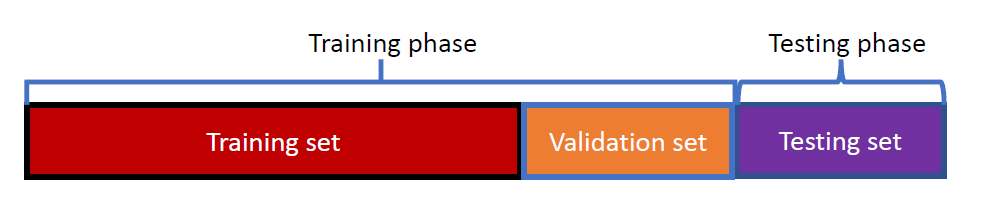

# Logistic Regression Cont.

**Loss Function**

$$
\min_{\vec{w}} 
\biggr[
y_i\log{p_i} + (1-y_i)\log{(1-p_i)}
\biggr]
$$

> The derivation will be covered by me later or in *CIS4526*. 

A hyperparameter is attached onto the above term to control the components of $\vec{w}$ .

$$
+\lambda\|\vec{w}\|_2^2
$$

## Evaluation for Binary Classification
### Accuracy

$$
\text{Accuracy} = \frac{\# \text{ num correct predicts}}{\# \text{ Total predicts}}
$$

This is valid for *balanced* datasets but does not end well for imbalanced datasets. Consider a data with 9 negative samples and 1 positive sample with the predictor always returning a `0`. This would result in a 90% overall accuracy yet a complete misclassification of a class. 

### Metrics: TP, FP, FN, TN

|                    | Positive (truth)    | Negative (Truth)    |
| ------------------ | ------------------- | ------------------- |
| Positive (Predict) | TP - True Positive  | FP - False Positive |
| Negative (Predict) | FN - False Negative | TN - True Negative  | 

#### Recall and Precision

> Think of Conditional Probability when looking at these. 

$$
P(A | B) = \frac{P(A \cap B)}{P(B)}
$$

Chose to optimize for 
+ Recall, if the cost of `FN` is high (medical diagnosis)
+ Precision, if the cost of `FP` is high (filtering spam emails)
	+ Here we are okay with a few more `FN` since we would rather let in a few spam emails than miss important emails

##### Recall

$$
\text{Recall} = \frac{TP}{TP + FN}
$$

Recall measures the proportion of positive instances that were correctly identified by the model, out of all the positive instances that actually exist in the data.

A large recall means more positives instances would be found by the classifier.

##### Precision

$$
\text{Precision} = \frac{TP}{TP + FP}
$$

Precision measures the proportion of positive instances that were correctly identified by the model, out of all the instances that the model predicted as positive.

A large precision implies a higher probability a positive prediction is correct. 

##### F1 Score
> Harmonic mean between precision and recall

$$
F_1 = \frac{2}{\frac{1}{\text{Recall}}+\frac{1}{\text{Precision}}} = \frac{2\times\text{Recall}\times\text{Precision}}{\text{Recall}+\text{Precision}}
$$

### Hyperparameter Selection Method
<!-- forgot to add this in the main commit -->

A *new* set, the validation set, is used for hyperparameter selection, during the training phase

Steps:
1. Select some hyperparameters where $\lambda \in \mathbb{R}_{\geq0}$
	+ $\lambda=0$ is just linear regression
2. For each $\lambda$ , train via training set and validate (test) via validation set.
3. Select the best performing $\lambda$ as the hyperparameter and retrain the model. However, without the validation set this time. 

