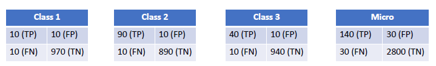

# # Multi Class Classification

Given $\{(x_i, y_i)\}_{i=1}^n$ samples, the goal now is to learn a mapping function where 

$$
\vec{x} \stackrel{f(\vec{x})}{\longrightarrow}
\begin{cases}
0\\
1\\
\vdots\\
K-1
\end{cases}
$$

where $K$ is the number of classes.

## Mappings

Each class has a mapping function

$$
\begin{align}
z_{i, 1} &= w^T_1x_i = w_{1, 0} + w_{1, 1}x_{i, 1} + \dotso w_{1,d}x_{i, d} \\
z_{i, 2} &= w^T_2x_i = w_{2, 0} + w_{2, 1}x_{i, 2} + \dotso w_{2,d}x_{i, d} \\
&\ \ \vdots \\
z_{i, K} &= w^T_2x_i = w_{K, 0} + w_{K, 1}x_{i, 2} + \dotso w_{K,d}x_{i, d} \\
\end{align}
$$

Each class involved has a parameter vector $w_k \in \mathbb{R}^{d+1}$

Here is the matrix form of this:

$$
\begin{bmatrix}
w_{1,0} & w_{1, 1}& \dotso & w_{1, d} \\
\vdots &\vdots & \ddots & \vdots \\
w_{K,0} & w_{K, 1}& \dotso & w_{K, d} \\
\end{bmatrix}
\begin{bmatrix}
1 \\
x_{i, 1} \\
\vdots \\
x_{i, d}
\end{bmatrix}
=
\begin{bmatrix}
z_{i, 1} \\
\vdots \\
z_{i, K}
\end{bmatrix}
$$

$$
W^Tx_i = z_i
$$

## Getting Class Probability?

After doing the operation $W^T\vec{x}$ we are left with some $\vec{z}$ that has numbers generated based on our selected weights in $W$ .

Notice that each $z_i \in \vec{z}$ represents in *some* way the probability of $\vec{x}$ **belonging to** class $i$ .

Since $z_i$ can be negative we need to normalize it.

For one we can get it to be positive via:

$$
\exp(z_i)
$$

Since we will do this to all elements of $\vec{z}$ , we can also divide by the sum of them to get the class based probabilities.

$$
\text{softmax}(\vec{z}) = 
\begin{bmatrix}
\frac{\exp(z_1)}{\sum_{j=1}^K \exp(z_j) } \\
\frac{\exp(z_2)}{\sum_{j=1}^K \exp(z_j) } \\
\vdots \\
\frac{\exp(z_K)}{\sum_{j=1}^K \exp(z_j) } \\
\end{bmatrix}
$$

Notice that 

$$
\begin{align}
0 \lt & \frac{\exp(z_i)}{\sum_{j=1}^K \exp(z_j) } \lt 1 \\
\sum_{i=1}^K & \frac{\exp(z_i)}{\sum_{j=1}^K \exp(z_j) } = 1
\end{align}
$$

## Loss Function

The label of each sample is a one-hot column vector.

$$
Y = [\vec{y}_1, \vec{y}_2, \dotso, \vec{y}_n] =
\begin{bmatrix}
1 & 1 & 0 & \dotso & 0 \\
0 & 0 & 0 & \dotso & 1 \\
0 & 0 & 1 & \dotso & 0 \\
0 & 0 & 0  &\dotso & 0 \\
\end{bmatrix}
$$

The example above says that samples 1 and 2 where of class 1 while the 3rd sample was of class 3. 

### The Math

Here is what we want to maximize:

$$
\max_{\mathbf{W}} \prod_{i=1}^n \prod_{k=1}^K p(k|x_i)^{y_{ki}} \to \min_{\mathbf{W}} \biggr[ -\log \biggr(\prod_{i=1}^n \prod_{k=1}^K p(k|x_i)^{y_{ki}} \biggr)  \biggr]
$$

Given a sample $i$ belonging of class $k$ we want the highest probability at $p(k|x_i)$ which is where the $1$ would be in the $\mathbf{Y}$ matrix.

Simplified:

$$
\min_{\mathbf{W}} - \biggr[
\sum_{i=1}^n \sum_{k=1}^K -y_{ki} \log \big(\ p(k|x_i)\ \big)
\biggr]
$$

## Evaluation
The evaluation is quite the same as [[Week 5.02 - 02 16 23 - Evaluation of Binary Classifiers]]. However we have Micro/Macro versions of the same thing.  

I will consider the precision for sake of example. 

### Micro
Collect data on all classes and **evaluate regarding class size**. 

*Recall* what precision is: $\frac{\text{TP}}{\text{TP} + \text{FP}}$

$$
\text{Micro Precision} = \frac{10+90+40}{(10+10)+(90+10)+(40+10)}
$$

### Macro
+ Compute precision per class. 
+ Average them. 

$$
\text{Macro Precision} = \frac{\text{Precision}_1+\text{Precision}_2+\text{Precision}_3}{3}
$$